# **meuPortfolio - Relatório de Base de Dados**
## **Sistema de Gestão de Portfólios de Investimento**

---

### **1. Introdução e Contextualização**

#### **1.1 Descrição do Projeto**

O **meuPortfolio** é um projeto desenvolvido no âmbito da disciplina de Bases de Dados da Universidade de Aveiro, no ano letivo de 2024/2025. O sistema tem como objetivo principal a criação de uma base de dados robusta e eficiente para suportar operações de **fractional trading**, permitindo aos utilizadores gerir os seus portfólios de investimento de forma inteligente e automatizada.

#### **1.2 Objetivos do Sistema**

O projeto visa desenvolver uma solução completa de gestão de portfólios que inclui:

- **Gestão de utilizadores** com diferentes níveis de acesso (Basic e Premium)
- **Sistema de trading fracionário** para diversos tipos de ativos (ações, índices, criptomoedas, commodities)
- **Análise de risco automatizada** com métricas financeiras avançadas
- **Gestão de fundos** com controlo rigoroso de transações
- **Sistema de auditoria** completo para tracking de todas as operações
- **Funcionalidades premium** para utilizadores avançados

#### **1.3 Arquitetura Tecnológica**

O sistema **meuPortfolio** foi desenvolvido utilizando uma arquitetura moderna de três camadas:

- **Base de Dados**: SQL Server Management Studio para o design e implementação da estrutura de dados
- **Backend API**: Rust para desenvolvimento de uma API REST de alta performance
- **Frontend**: React para uma interface de utilizador moderna e responsiva

#### **1.4 Âmbito do Relatório**

Este relatório concentra-se exclusivamente na **análise, design e implementação da base de dados** do sistema meuPortfolio. A documentação detalhada do backend API e do frontend será apresentada em relatórios complementares específicos para cada componente.

O foco principal será demonstrar:
- O processo de análise de requisitos e modelação conceptual
- As decisões de design da base de dados
- A implementação técnica em SQL Server
- Os mecanismos avançados de integridade, performance e auditoria implementados

#### **1.5 Contexto Académico**

Este trabalho representa a aplicação prática dos conhecimentos adquiridos na disciplina de Bases de Dados, evidenciando competências em:
- Modelação conceptual e normalização
- Implementação de estruturas relacionais complexas
- Desenvolvimento de stored procedures, triggers e funções
- Otimização de performance e estratégias de indexação
- Sistemas de logging e auditoria de dados

### **2. Análise de Requisitos**

#### **2.1 Requisitos Funcionais**

**RF01 - Gestão de Utilizadores**
- Registo e autenticação de utilizadores
- Dois tipos de conta: Basic e Premium
- Gestão de informações pessoais e métodos de pagamento
- Sistema de subscrições automáticas

**RF02 - Gestão de Portfólios**
- Criação e gestão de múltiplos portfólios por utilizador
- Acompanhamento de fundos disponíveis e rentabilidade
- Histórico completo de alterações

**RF03 - Sistema de Trading**
- Compra e venda de ativos (ações, índices, criptomoedas, commodities)
- Trading fracionário para todos os tipos de ativos
- Execução automática de transações
- Controlo de disponibilidade de fundos

**RF04 - Gestão de Fundos**
- Depósitos e levantamentos de conta
- Alocação e desalocação de fundos para portfólios
- Upgrade para contas Premium
- Histórico detalhado de transações financeiras

**RF05 - Análise de Risco (Premium)**
- Cálculo automático de métricas de risco
- Análise de tendências históricas
- Classificação de perfil de risco
- Alertas e recomendações

#### **2.2 Requisitos Não Funcionais**

**RNF01 - Performance**
- Tempo de resposta inferior a 2 segundos para consultas simples
- Suporte para operações concorrentes de múltiplos utilizadores

**RNF02 - Escalabilidade**
- Estrutura preparada para crescimento de dados
- Índices otimizados para consultas frequentes

**RNF03 - Fiabilidade**
- Consistência transacional para operações financeiras
- Sistema de logging para recuperação e debugging

#### **2.3 Requisitos de Dados**

**RD01 - Dados de Utilizadores**
- Informações pessoais, contactos e preferências
- Dados financeiros e métodos de pagamento
- Histórico de subscrições e upgrades

**RD02 - Dados de Ativos**
- Informações detalhadas por tipo de ativo
- Histórico de preços e volumes
- Metadados específicos (setor, blockchain, etc.)

**RD03 - Dados Transacionais**
- Registo completo de todas as transações
- Estados e validações de operações
- Timestamps precisos para auditoria

**RD04 - Dados de Análise**
- Métricas de risco calculadas
- Histórico de performance de portfólios
- Logs de sistema para monitorização

### **3. Modelo Conceptual (DER - Diagrama Entidade-Relacionamento)**

#### **3.1 Entidades Identificadas**

Com base na análise de requisitos, foram identificadas as seguintes entidades principais para o sistema meuPortfolio:

**Entidades Principais:**
- **Users** - Utilizadores do sistema (Basic e Premium)
- **Portfolios** - Portfólios de investimento dos utilizadores
- **Assets** - Ativos disponíveis para trading (ações, índices, cripto, commodities)
- **Transactions** - Transações de compra/venda de ativos
- **FundTransactions** - Movimentações financeiras (depósitos, levantamentos, etc.)
- **PortfolioHoldings** - Holdings atuais de cada portfólio
- **RiskMetrics** - Métricas de análise de risco (Premium)
- **ApplicationLogs** - Logs de auditoria e monitorização

**Entidades de Detalhes Específicos:**
- **StockDetails** - Detalhes específicos de ações (setor, país, market cap)
- **CryptoDetails** - Detalhes de criptomoedas (blockchain, supply)
- **CommodityDetails** - Detalhes de commodities (categoria, unidade)
- **IndexDetails** - Detalhes de índices (país, região, componentes)
- **AssetPrices** - Histórico de preços dos ativos

#### **3.2 Overview Geral dos Relacionamentos**

O sistema meuPortfolio implementa uma arquitetura relacional complexa com **13 entidades principais** organizadas em **4 grupos funcionais**:

**A. GRUPO UTILIZADORES & CONTAS**
- **Users** (entidade central) - Conta principal com sistema de subscrições
- **FundTransactions** - Auditoria de movimentações financeiras
- **RiskMetrics** - Análise de risco (funcionalidade Premium)

**B. GRUPO PORTFÓLIOS & TRADING** 
- **Portfolios** - Carteiras de investimento dos utilizadores
- **Transactions** - Operações de compra/venda de ativos
- **PortfolioHoldings** - Holdings atuais otimizados para performance

**C. GRUPO ATIVOS & MERCADO**
- **Assets** - Ativos base (ações, índices, cripto, commodities)
- **AssetPrices** - Histórico de preços e volumes
- **StockDetails, CryptoDetails, CommodityDetails, IndexDetails** - Especialização por tipo

**D. GRUPO AUDITORIA & LOGS**
- **ApplicationLogs** - Sistema de logging e auditoria completo

**Mapa de Relacionamentos Principais:**
```
INCLUIR DIAGRAMA DE CHEN ATUALIZDO!!!
```

**Cardinalidades Detalhadas:**
- **Users (1) → Portfolios (N)**: Um utilizador pode criar múltiplos portfólios
- **Users (1) → Transactions (N)**: Um utilizador realiza múltiplas transações
- **Users (1) → FundTransactions (N)**: Um utilizador tem múltiplas movimentações
- **Users (1) → RiskMetrics (N)**: Um utilizador premium tem análises ao longo do tempo
- **Portfolios (1) → Transactions (N)**: Um portfólio contém múltiplas transações
- **Portfolios (1) → PortfolioHoldings (N)**: Um portfólio detém múltiplos ativos
- **Assets (1) → Transactions (N)**: Um ativo é transacionado múltiplas vezes
- **Assets (1) → AssetPrices (N)**: Um ativo tem histórico de preços
- **Assets (1) → AssetDetails (1)**: Relacionamento de especialização por tipo

#### **3.3 Entidades Detalhadas**

## **3.3.1 Entidade: Users** (Utilizadores)

**Objetivo:** Gestão central de utilizadores com sistema de subscrições Premium e métodos de pagamento integrados.

| Atributo | Tipo de Dados | Descrição | Restrições |
|----------|---------------|-----------|------------|
| `UserID` | UNIQUEIDENTIFIER | Identificador único do utilizador | PRIMARY KEY, DEFAULT NEWID() |
| `Name` | NVARCHAR(100) | Nome completo do utilizador | NOT NULL |
| `Email` | NVARCHAR(100) | Email de login (único) | NOT NULL, UNIQUE |
| `Password` | NVARCHAR(100) | Password (texto simples para dev) | NOT NULL |
| `CountryOfResidence` | NVARCHAR(100) | País de residência | NOT NULL |
| `IBAN` | NVARCHAR(34) | Conta bancária internacional | NOT NULL |
| `UserType` | NVARCHAR(20) | Tipo de conta do utilizador | NOT NULL |
| `AccountBalance` | DECIMAL(18,2) | Saldo disponível na conta | NOT NULL, DEFAULT 0.00 |
| `PaymentMethodType` | NVARCHAR(30) | Tipo de método de pagamento | NULL |
| `PaymentMethodDetails` | NVARCHAR(255) | Detalhes do método (ex: "VISA ****4582") | NULL |
| `PaymentMethodExpiry` | DATE | Data de expiração (cartões) | NULL |
| `PaymentMethodActive` | BIT | Se o método está ativo | DEFAULT 1 |
| `IsPremium` | BIT | Flag de conta Premium | DEFAULT 0 |
| `PremiumStartDate` | DATETIME | Início da subscrição Premium | NULL |
| `PremiumEndDate` | DATETIME | Fim da subscrição Premium | NULL |
| `MonthlySubscriptionRate` | DECIMAL(18,2) | Taxa mensal da subscrição | DEFAULT 50.00 |
| `AutoRenewSubscription` | BIT | Renovação automática | DEFAULT 1 |
| `LastSubscriptionPayment` | DATETIME | Último pagamento de subscrição | NULL |
| `NextSubscriptionPayment` | DATETIME | Próximo pagamento devido | NULL |
| `CreatedAt` | DATETIME | Data de criação da conta | NOT NULL, DEFAULT SYSDATETIME() |
| `UpdatedAt` | DATETIME | Última atualização | NOT NULL, DEFAULT SYSDATETIME() |

**Constraints Implementadas:**
- `CHECK (UserType IN ('Basic', 'Premium'))`: Validação do tipo de utilizador
- `CK_Users_AccountBalance_NonNegative`: CHECK (AccountBalance >= 0)
- `CK_Users_PaymentMethodType`: CHECK (PaymentMethodType IN ('CreditCard', 'BankTransfer', 'PayPal', 'Other') OR PaymentMethodType IS NULL)
- `CK_Users_SubscriptionLogic`: CHECK ((IsPremium = 0) OR (IsPremium = 1 AND PremiumStartDate IS NOT NULL AND PremiumEndDate IS NOT NULL))
- `CK_Users_SubscriptionRate_Positive`: CHECK (MonthlySubscriptionRate > 0)

---

## **3.3.2 Entidade: Portfolios** (Portfólios)

**Objetivo:** Gestão de múltiplos portfólios de investimento por utilizador.

| Atributo | Tipo de Dados | Descrição | Restrições |
|----------|---------------|-----------|------------|
| `PortfolioID` | INT IDENTITY(1,1) | Identificador único | PRIMARY KEY |
| `UserID` | UNIQUEIDENTIFIER | Proprietário do portfólio | NOT NULL, FOREIGN KEY → Users.UserID, ON DELETE CASCADE |
| `Name` | NVARCHAR(100) | Nome do portfólio | NOT NULL |
| `CreationDate` | DATETIME | Data de criação | NOT NULL, DEFAULT SYSDATETIME() |
| `CurrentFunds` | DECIMAL(18,2) | Fundos disponíveis | NOT NULL, DEFAULT 0 |
| `CurrentProfitPct` | DECIMAL(10,2) | Percentagem de lucro atual | NOT NULL, DEFAULT 0 |
| `LastUpdated` | DATETIME | Última atualização | NOT NULL, DEFAULT SYSDATETIME() |

---

## **3.3.3 Entidade: Assets** (Ativos)

**Objetivo:** Catálogo central de todos os ativos disponíveis para trading (ações, índices, criptomoedas, commodities).

| Atributo | Tipo de Dados | Descrição | Restrições |
|----------|---------------|-----------|------------|
| `AssetID` | INT IDENTITY(1,1) | Identificador único | PRIMARY KEY |
| `Name` | NVARCHAR(100) | Nome completo do ativo | NOT NULL |
| `Symbol` | NVARCHAR(20) | Símbolo de trading (único) | NOT NULL, UNIQUE |
| `AssetType` | NVARCHAR(20) | Tipo de ativo | NOT NULL |
| `Price` | DECIMAL(18,2) | Preço atual | NOT NULL |
| `Volume` | BIGINT | Volume de trading | NOT NULL |
| `AvailableShares` | DECIMAL(18,6) | Ações disponíveis para trading | NOT NULL |
| `LastUpdated` | DATETIME | Última atualização de preço | NOT NULL, DEFAULT SYSDATETIME() |

**Constraints Implementadas:**
- `CHECK (AssetType IN ('Stock', 'Index', 'Cryptocurrency', 'Commodity'))`

---

## **3.3.4 Entidade: AssetPrices** (Histórico de Preços)

**Objetivo:** Armazenamento do histórico completo de preços para análise técnica e cálculos de risco.

| Atributo | Tipo de Dados | Descrição | Restrições |
|----------|---------------|-----------|------------|
| `PriceID` | BIGINT IDENTITY(1,1) | Identificador único | PRIMARY KEY |
| `AssetID` | INT | Ativo referenciado | NOT NULL, FOREIGN KEY → Assets.AssetID, ON DELETE CASCADE |
| `Price` | DECIMAL(18,2) | Preço de fecho | NOT NULL |
| `AsOf` | DATETIME | Data/hora do preço | NOT NULL, DEFAULT SYSDATETIME() |
| `OpenPrice` | DECIMAL(18,2) | Preço de abertura | NOT NULL |
| `HighPrice` | DECIMAL(18,2) | Preço máximo do período | NOT NULL |
| `LowPrice` | DECIMAL(18,2) | Preço mínimo do período | NOT NULL |
| `Volume` | BIGINT | Volume negociado | NOT NULL |
| `ChangePercent` | DECIMAL(10,4) | Percentagem de variação do preço | NULL |

**Nota:** O campo `ChangePercent` foi adicionado através da migration `migration_add_changepercent.sql` para suporte a importação de dados históricos com percentagem de variação.

---

## **3.3.5 Entidade: StockDetails** (Detalhes de Ações)

**Objetivo:** Informações específicas de ações (especialização de Assets).

| Atributo | Tipo de Dados | Descrição | Restrições |
|----------|---------------|-----------|------------|
| `AssetID` | INT | Referência ao ativo | PRIMARY KEY, FOREIGN KEY → Assets.AssetID, ON DELETE CASCADE |
| `Sector` | NVARCHAR(100) | Setor económico | NOT NULL |
| `Country` | NVARCHAR(100) | País da empresa | NOT NULL |
| `MarketCap` | DECIMAL(18,2) | Capitalização de mercado | NOT NULL |
| `LastUpdated` | DATETIME | Última atualização | NOT NULL, DEFAULT SYSDATETIME() |

---

## **3.3.6 Entidade: CryptoDetails** (Detalhes de Criptomoedas)

**Objetivo:** Informações específicas de criptomoedas (especialização de Assets).

| Atributo | Tipo de Dados | Descrição | Restrições |
|----------|---------------|-----------|------------|
| `AssetID` | INT | Referência ao ativo | PRIMARY KEY, FOREIGN KEY → Assets.AssetID, ON DELETE CASCADE |
| `Blockchain` | NVARCHAR(50) | Rede blockchain | NOT NULL |
| `MaxSupply` | DECIMAL(18,0) | Supply máximo (NULL se ilimitado) | NULL |
| `CirculatingSupply` | DECIMAL(18,0) | Supply em circulação | NOT NULL |
| `LastUpdated` | DATETIME | Última atualização | NOT NULL, DEFAULT SYSDATETIME() |

---

## **3.3.7 Entidade: CommodityDetails** (Detalhes de Commodities)

**Objetivo:** Informações específicas de commodities (especialização de Assets).

| Atributo | Tipo de Dados | Descrição | Restrições |
|----------|---------------|-----------|------------|
| `AssetID` | INT | Referência ao ativo | PRIMARY KEY, FOREIGN KEY → Assets.AssetID, ON DELETE CASCADE |
| `Category` | NVARCHAR(50) | Categoria da commodity | NOT NULL |
| `Unit` | NVARCHAR(20) | Unidade de medida | NOT NULL |
| `LastUpdated` | DATETIME | Última atualização | NOT NULL, DEFAULT SYSDATETIME() |

---

## **3.3.8 Entidade: IndexDetails** (Detalhes de Índices)

**Objetivo:** Informações específicas de índices de mercado (especialização de Assets).

| Atributo | Tipo de Dados | Descrição | Restrições |
|----------|---------------|-----------|------------|
| `AssetID` | INT | Referência ao ativo | PRIMARY KEY, FOREIGN KEY → Assets.AssetID, ON DELETE CASCADE |
| `Country` | NVARCHAR(100) | País do índice | NOT NULL |
| `Region` | NVARCHAR(50) | Região geográfica | NOT NULL |
| `IndexType` | NVARCHAR(50) | Tipo de índice | NOT NULL |
| `ComponentCount` | INT | Número de componentes | NULL |
| `LastUpdated` | DATETIME | Última atualização | NOT NULL, DEFAULT SYSDATETIME() |

---

## **3.3.9 Entidade: Transactions** (Transações de Trading)

**Objetivo:** Registo de todas as operações de compra e venda de ativos.

| Atributo | Tipo de Dados | Descrição | Restrições |
|----------|---------------|-----------|------------|
| `TransactionID` | BIGINT IDENTITY(1,1) | Identificador único | PRIMARY KEY |
| `UserID` | UNIQUEIDENTIFIER | Utilizador da transação | NOT NULL, FOREIGN KEY → Users.UserID, ON DELETE CASCADE |
| `PortfolioID` | INT | Portfólio envolvido | NOT NULL, FOREIGN KEY → Portfolios.PortfolioID |
| `AssetID` | INT | Ativo transacionado | NOT NULL, FOREIGN KEY → Assets.AssetID |
| `TransactionType` | NVARCHAR(10) | Tipo de operação | NOT NULL |
| `Quantity` | DECIMAL(18,6) | Quantidade (suporte fracionário) | NOT NULL |
| `UnitPrice` | DECIMAL(18,4) | Preço unitário | NOT NULL |
| `TransactionDate` | DATETIME | Data da transação | NOT NULL, DEFAULT SYSDATETIME() |
| `Status` | NVARCHAR(20) | Estado da transação | NOT NULL, DEFAULT 'Pending' |

**Constraints Implementadas:**
- `CHECK (TransactionType IN ('Buy', 'Sell'))`
- `CHECK (Status IN ('Pending', 'Executed', 'Failed', 'Cancelled'))`

---

## **3.3.10 Entidade: FundTransactions** (Transações de Fundos)

**Objetivo:** Auditoria completa de todos os movimentos de fundos na conta dos utilizadores.

| Atributo | Tipo de Dados | Descrição | Restrições |
|----------|---------------|-----------|------------|
| `FundTransactionID` | BIGINT IDENTITY(1,1) | Identificador único | PRIMARY KEY |
| `UserID` | UNIQUEIDENTIFIER | Utilizador envolvido | NOT NULL, FOREIGN KEY → Users.UserID, ON DELETE CASCADE |
| `PortfolioID` | INT | Carteira envolvida (opcional) | NULL, FOREIGN KEY → Portfolios.PortfolioID |
| `TransactionType` | NVARCHAR(20) | Tipo de movimento de fundos | NOT NULL |
| `Amount` | DECIMAL(18,2) | Montante da transação | NOT NULL |
| `BalanceAfter` | DECIMAL(18,2) | Saldo após a transação | NOT NULL |
| `Description` | NVARCHAR(255) | Descrição adicional | NULL |
| `RelatedAssetTransactionID` | BIGINT | Transação de ativo relacionada | NULL |
| `CreatedAt` | DATETIME | Data de criação | NOT NULL, DEFAULT SYSDATETIME() |

**Constraints Implementadas:**
- `CHECK (TransactionType IN ('Deposit', 'Withdrawal', 'Allocation', 'Deallocation', 'PremiumUpgrade', 'AssetPurchase', 'AssetSale'))`

---

## **3.3.11 Entidade: PortfolioHoldings** (Holdings de Portfólio)

**Objetivo:** Otimização de performance - armazena holdings atuais calculados para evitar agregações complexas.

| Atributo | Tipo de Dados | Descrição | Restrições |
|----------|---------------|-----------|------------|
| `HoldingID` | BIGINT IDENTITY(1,1) | Identificador único | PRIMARY KEY |
| `PortfolioID` | INT | Portfólio proprietário | NOT NULL, FOREIGN KEY → Portfolios.PortfolioID, ON DELETE CASCADE |
| `AssetID` | INT | Ativo detido | NOT NULL, FOREIGN KEY → Assets.AssetID, ON DELETE CASCADE |
| `QuantityHeld` | DECIMAL(18,6) | Quantidade total detida | NOT NULL |
| `AveragePrice` | DECIMAL(18,4) | Preço médio de aquisição | NOT NULL |
| `TotalCost` | DECIMAL(18,2) | Custo total investido | NOT NULL |
| `LastUpdated` | DATETIME | Última atualização | NOT NULL, DEFAULT SYSDATETIME() |

**Constraints Implementadas:**
- `UK_PortfolioHoldings_Portfolio_Asset`: UNIQUE(PortfolioID, AssetID)
- `CK_PortfolioHoldings_QuantityHeld_Positive`: CHECK (QuantityHeld > 0)

---

## **3.3.12 Entidade: RiskMetrics** (Métricas de Risco)

**Objetivo:** Armazenamento de análises de risco calculadas (funcionalidade Premium).

| Atributo | Tipo de Dados | Descrição | Restrições |
|----------|---------------|-----------|------------|
| `MetricID` | INT IDENTITY(1,1) | Identificador único | PRIMARY KEY |
| `UserID` | UNIQUEIDENTIFIER | Utilizador analisado | NOT NULL, FOREIGN KEY → Users.UserID, ON DELETE CASCADE |
| `MaximumDrawdown` | DECIMAL(10,2) | Maior perda histórica (%) | NULL |
| `Beta` | DECIMAL(10,2) | Correlação com mercado | NULL |
| `SharpeRatio` | DECIMAL(10,2) | Rácio risco/retorno | NULL |
| `AbsoluteReturn` | DECIMAL(10,2) | Retorno absoluto (%) | NULL |
| `VolatilityScore` | DECIMAL(10,2) | Score de volatilidade | NULL |
| `RiskLevel` | NVARCHAR(20) | Nível de risco classificado | NOT NULL |
| `CapturedAt` | DATETIME | Data do cálculo | NOT NULL, DEFAULT SYSDATETIME() |

---

## **3.3.13 Entidade: ApplicationLogs** (Logs de Aplicação)

**Objetivo:** Sistema de auditoria e logging para monitorização e debugging.

| Atributo | Tipo de Dados | Descrição | Restrições |
|----------|---------------|-----------|------------|
| `LogID` | BIGINT IDENTITY(1,1) | Identificador único | PRIMARY KEY |
| `LogLevel` | NVARCHAR(10) | Nível de severidade | NOT NULL |
| `EventType` | NVARCHAR(50) | Tipo de evento registado | NOT NULL |
| `TableName` | NVARCHAR(100) | Tabela afetada (se aplicável) | NULL |
| `UserID` | UNIQUEIDENTIFIER | Utilizador envolvido | NULL, FOREIGN KEY → Users.UserID, ON DELETE SET NULL |
| `Message` | NVARCHAR(500) | Descrição do evento | NOT NULL |
| `CreatedAt` | DATETIME | Timestamp do evento | NOT NULL, DEFAULT SYSDATETIME() |

**Constraints Implementadas:**
- `CHECK (LogLevel IN ('INFO', 'WARN', 'ERROR'))`

**Nota:** Esta tabela foi posteriormente extendida no arquivo `009_enhanced_logging_system.sql` com campos adicionais para tracking de APIs, dados JSON, performance metrics e contexto de sessão.

---

#### **3.4 Arquivos de Implementação e Diagrama da Base de Dados**

A implementação das entidades detalhadas acima foi realizada através dos seguintes arquivos de migração SQL Server:

- **`000_init.sql`** - Inicialização do schema portfolio
- **`001_tables.sql`** - Criação de todas as tabelas principais e suas constraints
- **`002_indexes.sql`** - Definição dos índices de performance
- **`003_views.sql`** - Criação das views de reporting
- **`004_triggers.sql`** - Implementação dos triggers de auditoria
- **`005_1_user_procedures.sql`** - Stored procedures de gestão de utilizadores
- **`005_2_portfolio_procedures.sql`** - Stored procedures de gestão de portfólios
- **`005_3_trading_procedures.sql`** - Stored procedures do sistema de trading
- **`005_4_asset_procedures.sql`** - Stored procedures de gestão de ativos
- **`005_5_risk_procedures.sql`** - Stored procedures de análise de risco
- **`006_functions.sql`** - User-defined functions
- **`006_1_risk_functions.sql`** - Funções específicas de cálculo de risco
- **`007_risk_automation.sql`** - Automação do sistema de análise de risco
- **`008_portfolio_creation_trigger.sql`** - Trigger de criação automática de portfólios
- **`009_enhanced_logging_system.sql`** - Sistema avançado de logging e auditoria

**Diagrama Completo da Base de Dados:**

O diagrama relacional completo do sistema meuPortfolio, gerado pelo SQL Server Management Studio, pode ser observado na seguinte imagem:


*Figura 3.1: Diagrama Entidade-Relacionamento completo da base de dados meuPortfolio gerado pelo SQL Server Management Studio, mostrando todas as entidades, relacionamentos e cardinalidades implementadas.*

---

### **4. Normalização da Base de Dados**

#### **4.1 Conformidade com as Formas Normais**

A base de dados meuPortfolio foi desenvolvida seguindo os princípios de normalização relacional até à Terceira Forma Normal (3NF), com exceções deliberadas para otimização de performance e simplificação arquitetural. A estratégia adotada prioriza a integridade referencial e a eliminação de redundâncias desnecessárias, mantendo exceções justificadas tecnicamente.

#### **4.2 Análise de Conformidade por Entidade**

| **Entidade** | **1NF** | **2NF** | **3NF** | **BCNF** | **Estado de Normalização** |
|--------------|---------|---------|---------|----------|----------------------------|
| Users | ✓ | ✓ | × | × | Desnormalizada intencionalmente |
| Portfolios | ✓ | ✓ | ✓ | ✓ | Totalmente normalizada |
| Assets | ✓ | ✓ | ✓ | ✓ | Totalmente normalizada |
| AssetPrices | ✓ | ✓ | ✓ | ✓ | Totalmente normalizada |
| StockDetails | ✓ | ✓ | ✓ | ✓ | Totalmente normalizada |
| CryptoDetails | ✓ | ✓ | ✓ | ✓ | Totalmente normalizada |
| CommodityDetails | ✓ | ✓ | ✓ | ✓ | Totalmente normalizada |
| IndexDetails | ✓ | ✓ | ✓ | ✓ | Totalmente normalizada |
| Transactions | ✓ | ✓ | ✓ | ✓ | Totalmente normalizada |
| FundTransactions | ✓ | ✓ | ✓ | ✓ | Totalmente normalizada |
| PortfolioHoldings | ✓ | ✓ | × | × | Desnormalizada intencionalmente |
| RiskMetrics | ✓ | ✓ | ✓ | ✓ | Totalmente normalizada |
| ApplicationLogs | ✓ | ✓ | ✓ | ✓ | Totalmente normalizada |

#### **4.3 Análise das Exceções à Normalização**

**4.3.1 Entidade Users - Violação da 3NF**

**Descrição da Violação:**
A entidade Users consolida informações de pagamento e subscrição que, segundo os princípios da 3NF, deveriam residir em entidades separadas (PaymentMethods e Subscriptions).

**Campos em Questão:**
```sql
-- Dados de método de pagamento
PaymentMethodType, PaymentMethodDetails, PaymentMethodExpiry, PaymentMethodActive

-- Dados de subscrição
PremiumStartDate, PremiumEndDate, MonthlySubscriptionRate, AutoRenewSubscription
```

**Justificação Técnica:**
A consolidação foi implementada considerando:
- Simplificação arquitetural com redução de joins complexos
- Padrão de uso dominante: um utilizador possui um método de pagamento ativo
- Melhoria na performance de consultas de autenticação e perfil
- Redução da complexidade de manutenção do código

**4.3.2 Entidade PortfolioHoldings - Violação da 3NF**

**Descrição da Violação:**
A entidade armazena dados derivados (AveragePrice, TotalCost) que podem ser calculados a partir da entidade Transactions, violando o princípio de eliminação de dependências transitivas.

**Campos Derivados:**
```sql
AveragePrice -- Calculável: média ponderada das transações
TotalCost    -- Calculável: AveragePrice × QuantityHeld
```

**Justificação Técnica:**
A desnormalização foi implementada para:
- Otimização crítica de performance em consultas de portfolio
- Resposta instantânea para dashboards de utilizador
- Eliminação de cálculos agregados complexos em tempo real
- Suporte a operações de alta frequência no sistema de trading

#### **4.4 Estratégias de Integridade e Consistência**

Para garantir a consistência dos dados nas áreas desnormalizadas, foram implementadas as seguintes estratégias:

**Sincronização Automática:**
- Triggers em Transactions para atualização automática de PortfolioHoldings
- Stored procedures para operações transacionais atómicas
- Constraints para prevenção de estados inconsistentes

**Auditoria e Verificação:**
- Sistema de logging completo para rastreamento de alterações
- Procedimentos de reconciliação para validação periódica
- Alertas automáticos para deteção de inconsistências

**Controlo Transacional:**
- Uso de transações explícitas para operações multi-tabela
- Rollback automático em caso de falhas de integridade
- Validação de constraints antes de commits

### **5. Esquema Relacional da Base de Dados**
- Transformação do modelo conceptual para relacional
- Definição de chaves primárias e estrangeiras
- Restrições de integridade

### **6. SQL DDL - Definição da Estrutura em SQL Server**
- Scripts de criação de schema e tabelas
- Definição de tipos de dados
- Constraints e restrições
- Relacionamentos entre tabelas

### **7. Estratégia de Indexação**

#### **7.1 Filosofia de Indexação**

A estratégia de indexação do sistema meuPortfolio foi desenvolvida com foco na **otimização de consultas críticas** e **performance de operações frequentes**. A abordagem prioriza índices não-clusterizados com colunas incluídas para minimizar operações de key lookup e maximizar a eficiência das consultas de negócio.

#### **7.2 Categorização dos Índices Implementados**

**7.2.1 Índices de Autenticação e Gestão de Utilizadores**

| Índice | Justificação Técnica |
|--------|---------------------|
| `IX_Users_Email` | Otimização de login - consulta mais frequente do sistema |
| `IX_Users_UserType` | Filtros por tipo de conta (Basic vs Premium) |
| `IX_Users_IsPremium` | Queries específicas para funcionalidades Premium |

**7.2.2 Índices de Gestão de Ativos**

| Índice | Justificação Técnica |
|--------|---------------------|
| `IX_Assets_Symbol` | Pesquisa rápida por símbolo de trading (UNIQUE já existente) |
| `IX_Assets_AssetType` | Filtros por categoria de ativo (Stock, Crypto, etc.) |
| `IX_IndexDetails_Country_Region` | Consultas geográficas de índices de mercado |

**7.2.3 Índices Críticos de Performance - Sistema de Trading**

| Índice | Estrutura | Justificação |
|--------|-----------|--------------|
| `IX_Transactions_PortfolioAsset` | (PortfolioID, AssetID) INCLUDE (TransactionType, Quantity, UnitPrice) | **Crítico**: Cálculo de holdings por ativo em portfólio |
| `IX_Transactions_Date` | (TransactionDate) INCLUDE (TransactionType, Quantity, UnitPrice) | Relatórios históricos e análise temporal |
| `IX_AssetPrices_AssetID_AsOf` | (AssetID, AsOf DESC) INCLUDE (Price, OpenPrice, HighPrice, LowPrice) | **Performance crítica**: Histórico de preços para gráficos |

**7.2.4 Índices de Otimização de Portfolio**

| Índice | Estrutura | Justificação |
|--------|-----------|--------------|
| `IX_Portfolios_UserID` | (UserID) INCLUDE (CurrentFunds, CurrentProfitPct) | Dashboard de utilizador - consulta mais frequente |
| `IX_PortfolioHoldings_PortfolioID` | (PortfolioID) INCLUDE (AssetID, QuantityHeld, AveragePrice, TotalCost) | **API crítica**: Visualização de holdings |

**7.2.5 Índices de Análise de Risco e Auditoria**

| Índice | Estrutura | Justificação |
|--------|-----------|--------------|
| `IX_RiskMetrics_UserID_CapturedAt` | (UserID, CapturedAt DESC) INCLUDE (MaximumDrawdown, SharpeRatio, RiskLevel) | Tendências de risco Premium |
| `IX_FundTransactions_UserID_Date` | (UserID, CreatedAt DESC) | Histórico financeiro por utilizador |
| `IX_FundTransactions_TransactionType` | (TransactionType, CreatedAt DESC) | Relatórios administrativos |

**7.2.6 Índices de Sistema de Logging**

| Índice | Estrutura | Justificação |
|--------|-----------|--------------|
| `IX_ApplicationLogs_CreatedAt` | (CreatedAt DESC) INCLUDE (LogLevel, EventType, UserID) | Monitorização do sistema |
| `IX_ApplicationLogs_UserID_Date` | (UserID, CreatedAt DESC) WHERE UserID IS NOT NULL | Auditoria por utilizador |
| `IX_ApplicationLogs_EventType_Table` | (EventType, TableName, CreatedAt DESC) | Debugging específico |


### **8. Views de Base de Dados**

#### **8.1 Arquitetura das Views**

O sistema **meuPortfolio** implementa **6 views estratégicas** que encapsulam consultas complexas e proporcionam camadas de abstração optimizadas para a API REST. Estas views seguem uma arquitetura hierárquica que espelha os domínios funcionais do sistema, garantindo **performance**, **manutenibilidade** e **separação de responsabilidades**.

**Distribuição Funcional das Views:**
- **Gestão de Portfólios** (2 views): `vw_PortfolioSummary`, `vw_PortfolioHoldings`
- **Gestão de Utilizadores** (1 view): `vw_UserAccountSummary`
- **Gestão de Ativos** (2 views): `vw_AssetDetails`, `vw_AssetPriceHistory`
- **Análise de Risco** (1 view): `vw_RiskAnalysis`

#### **8.2 Views de Gestão de Portfólios**

**8.2.1 View: `vw_PortfolioSummary`**

**Objetivo:** Agregação de métricas de performance e estatísticas operacionais de portfólios.

**Principais Funcionalidades:**
```sql
-- Métricas de Performance Calculadas
UnrealizedGainLossPercent = ((CurrentMarketValue - TotalInvested) / TotalInvested) * 100
TotalPortfolioValue = CurrentFunds + CurrentMarketValue

-- Estatísticas Operacionais
TotalTrades, LastTradeDate (via agregação de Transactions)
```

**Integração API:** Utilizada pelo endpoint `GET /api/v1/users/{id}/complete` para o dashboard principal.

**Otimizações Implementadas:**
- **LEFT JOINs** para portfolios sem holdings
- **Agregações pré-calculadas** para TotalInvested e CurrentMarketValue
- **ISNULL()** para tratamento de valores NULL em cálculos financeiros

**8.2.2 View: `vw_PortfolioHoldings`**

**Objetivo:** Visualização detalhada de holdings individuais com cálculos de performance em tempo real.

**Cálculos Financeiros Avançados:**
```sql
-- Performance Individual
UnrealizedGainLoss = (QuantityHeld * CurrentPrice) - TotalCost
GainLossPercentage = (UnrealizedGainLoss / TotalCost) * 100

-- Alocação de Portfolio  
PortfolioWeightPercent = (CurrentValue / TotalMarketValue) * 100
```

**Técnica Avançada:** Utilização de **CROSS APPLY** para cálculo dinâmico do valor total do portfólio, permitindo percentagens de alocação precisas.

**Integração API:** Suporte directo ao endpoint `GET /api/v1/portfolios?user_id={id}` para interfaces de trading.

#### **8.3 View de Gestão de Utilizadores**

**8.3.1 View: `vw_UserAccountSummary`**

**Objetivo:** Consolidação de informações completas de utilizador incluindo subscrições, métodos de pagamento e estatísticas financeiras.

**Campos Calculados Críticos:**
```sql
-- Gestão de Subscrições
DaysRemainingInSubscription = DATEDIFF(DAY, SYSDATETIME(), PremiumEndDate)
SubscriptionExpired = CASE WHEN PremiumEndDate <= SYSDATETIME() THEN 1 ELSE 0 END

-- Métricas Financeiras
TotalNetWorth = AccountBalance + TotalFundsInPortfolios + TotalMarketValue
```

**Agregações Complexas:** 
- **Subqueries correlacionadas** para LastFundTransactionDate e LastTradeDate
- **Múltiplos LEFT JOINs** para agregação de dados de portfólios

**Integração API:** Endpoint principal `GET /api/v1/users/{id}/complete` utilizado em múltiplas interfaces do frontend.

#### **8.4 Views de Gestão de Ativos**

**8.4.1 View: `vw_AssetDetails`**

**Objetivo:** Polimorfismo de ativos com informações específicas por tipo (Stock, Cryptocurrency, Commodity, Index).

**Polimorfismo Implementado:**
```sql
-- Adaptação por Tipo de Ativo
CategoryInfo = CASE 
    WHEN AssetType = 'Stock' THEN Sector
    WHEN AssetType = 'Cryptocurrency' THEN Blockchain
    WHEN AssetType = 'Commodity' THEN Category
END
```

**Performance Tracking:** Implementação de comparação de preços (Price30DaysAgo) via subquery optimizada.

**8.4.2 View: `vw_AssetPriceHistory`**

**Objetivo:** Histórico de preços com métricas de performance diária e volatilidade.

**Cálculos de Market Data:**
```sql
DailyChangePercent = ((ClosePrice - OpenPrice) / OpenPrice) * 100
DailyVolatilityPercent = ((HighPrice - LowPrice) / OpenPrice) * 100
```

**Integração API:** Suporte ao endpoint `GET /api/v1/assets/{id}/price-history` para gráficos de preços.

#### **8.5 View de Análise de Risco**

**8.5.1 View: `vw_RiskAnalysis`**

**Objetivo:** Consolidação de métricas de risco Premium com diversificação de portfólio.

**Métricas de Diversificação:**
```sql
UniqueAssetsHeld = COUNT(DISTINCT AssetID)
AssetTypesHeld = COUNT(DISTINCT AssetType)
TotalUnrealizedGainLoss = SUM((QuantityHeld * Price) - TotalCost)
```

**Restrição de Acesso:** Integração com campo `IsPremium` para funcionalidades exclusivas.

**Integração API:** Suporte aos endpoints de análise de risco Premium.


### **9. User Defined Functions (UDF)**

#### **9.1 Arquitetura Funcional**

O sistema **meuPortfolio** implementa **13 User Defined Functions ativas** que encapsulam cálculos financeiros complexos e operações utilitárias reutilizáveis. Estas funções seguem uma arquitetura modular organizada em **3 categorias funcionais**, garantindo **reutilização**, **consistência** e **performance** nas operações matemáticas críticas do sistema.

#### **9.2 Categorização das Funções Utilizadas**

| **Categoria Funcional** | **Quantidade** | **Finalidade Principal** |
|--------------------------|---------------|--------------------------|
| **Portfolio Financial Functions** | 5 funções | Cálculos agregados de performance |
| **Individual Holding Functions** | 3 funções | Métricas de holdings individuais |
| **User Account Functions** | 3 funções | Gestão de contas e subscrições |
| **Trading Calculation Functions** | 2 funções | Cálculos especializados de trading |

#### **9.3 Funções de Cálculos Financeiros de Portfolio**

**Objetivo:** Agregação de métricas financeiras complexas para análise de performance de portfólios completos.

| Função | Finalidade |
|--------|------------|
| `fn_PortfolioMarketValueV2` | Cálculo do valor de mercado atual otimizado |
| `fn_PortfolioTotalInvestment` | Soma do custo total investido (cost basis) |
| `fn_PortfolioUnrealizedGainLoss` | Lucro/prejuízo não realizado em valor absoluto |
| `fn_PortfolioUnrealizedGainLossPct` | Percentagem de lucro/prejuízo não realizado |
| `fn_PortfolioTotalValue` | Valor total (fundos disponíveis + investimentos) |

**Características Técnicas:**
- **Optimização V2**: Utilização da tabela desnormalizada `PortfolioHoldings` para performance superior
- **Composição funcional**: Funções que chamam outras funções para modularidade
- **Tratamento de NULL**: Implementação de `ISNULL()` para robustez em cálculos

#### **9.4 Funções de Holdings Individuais**

**Objetivo:** Cálculos específicos para posições individuais de ativos dentro de portfólios.

| Função | Finalidade |
|--------|------------|
| `fn_HoldingCurrentValue` | Valor atual de uma posição específica |
| `fn_HoldingUnrealizedGainLoss` | Lucro/prejuízo de uma posição individual |
| `fn_HoldingGainLossPercentage` | Percentagem de performance de uma posição |

**Aplicação:** Utilizadas intensivamente nas views `vw_PortfolioHoldings` para cálculos de performance em tempo real de ativos individuais.

#### **9.5 Funções de Gestão de Contas de Utilizador**

**Objetivo:** Métricas financeiras globais e gestão de subscrições Premium.

| Função | Finalidade |
|--------|------------|
| `fn_UserNetWorth` | Cálculo do património líquido total do utilizador |
| `fn_UserPremiumDaysRemaining` | Dias restantes na subscrição Premium |
| `fn_UserSubscriptionExpired` | Verificação de expiração de subscrição |

**Integração Crítica:**
- **`fn_UserNetWorth`**: Agregação de saldo de conta + fundos em portfólios + valor de mercado total
- **Funções Premium**: Suporte ao sistema de subscrições com cálculos temporais precisos

#### **9.6 Funções de Cálculos de Trading**

**Objetivo:** Operações matemáticas especializadas para o sistema de trading fracionário.

| Função | Finalidade |
|--------|------------|
| `fn_CalculateNewAveragePrice` | Preço médio após adição de shares |
| `fn_CalculatePartialSaleCostBasis` | Cost basis para vendas parciais |

**Características:** Críticas para operações de trading fracionário, garantindo cálculos precisos de preços médios e custos.

#### **9.7 Padrões de Design e Reutilização**

**Composição Funcional:**
- Funções complexas que chamam funções mais simples para modularidade
- Exemplo: `fn_PortfolioUnrealizedGainLossPct` utiliza `fn_PortfolioTotalInvestment` e `fn_PortfolioUnrealizedGainLoss`

**Estratégias de Performance:**
- **Optimização V2**: Migração para tabela `PortfolioHoldings` desnormalizada
- **Cálculos agregados** optimizados com `SUM()` em vez de loops
- **Tratamento de edge cases** com validações de divisão por zero

**Reutilização Extensiva:**
- **Views**: 5 das 6 views utilizam funções UDF para cálculos complexos
- **Stored Procedures**: 8 procedimentos integram funções para lógica de negócio
- **API Endpoints**: Cálculos financeiros consistentes através de toda a aplicação

#### **9.8 Impacto na Arquitetura Financeira**

As User Defined Functions constituem a **camada de cálculo financeiro** do sistema, proporcionando:

**Vantagens Implementadas:**
- **Consistência matemática** em todos os cálculos financeiros
- **Reutilização de código** eliminando duplicação de lógica complexa
- **Performance optimizada** através de cálculos especializados em SQL
- **Manutenibilidade** centralizada para alterações de fórmulas financeiras

**Métricas de Sucesso:**
- **100% de utilização** das funções implementadas demonstra design eficiente
- **Zero redundância** nos cálculos financeiros entre diferentes componentes
- **Suporte completo** ao trading fracionário através de funções especializadas

---

### **10. Stored Procedures**

#### **10.1 Panorama Geral dos Procedimentos Ativos**

O sistema meuPortfolio implementa **15 stored procedures ativos** distribuídos por **4 categorias funcionais**, cada um mapeado diretamente para endpoints específicos da API REST ou operações internas críticas. Os procedimentos encapsulam lógica de negócio complexa e garantem integridade transacional.

#### **10.2 Gestão de Utilizadores (4 procedimentos)**

| Procedimento | Endpoint API | Finalidade |
|--------------|--------------|------------|
| `sp_GetUserCompleteInfo` | `GET /api/v1/users/{userId}/complete` | Dados completos do utilizador |
| `sp_DepositFunds` | `POST /api/v1/users/{userId}/deposit` | Depósito de fundos |
| `sp_WithdrawFunds` | `POST /api/v1/users/{userId}/withdraw` | Levantamento de fundos |
| `sp_SetUserPaymentMethod` | `PUT /api/v1/users/{userId}/payment-method` | Gestão de métodos de pagamento |

**Funcionalidades implementadas:**
- Validação de saldos e limites
- Transações atómicas multi-tabela
- Auditoria automática via `FundTransactions`
- Gestão de subscrições e pagamentos

#### **10.3 Gestão de Portfólios (6 procedimentos)**

| Procedimento | Endpoint API | Finalidade |
|--------------|--------------|------------|
| `sp_CreatePortfolio` | `POST /api/v1/portfolios` | Criação de novos portfólios |
| `sp_UpdatePortfolio` | `PUT /api/v1/portfolios/{id}` | Atualização de portfólios existentes |
| `sp_AllocateFunds` | `POST /api/v1/users/{id}/allocate` | Alocação de fundos para portfólios |
| `sp_DeallocateFunds` | `POST /api/v1/users/{id}/deallocate` | Desalocação de fundos de portfólios |
| `sp_DepositFunds` | `POST /api/v1/users/{userId}/deposit` | Depósito na conta principal |
| `sp_WithdrawFunds` | `POST /api/v1/users/{userId}/withdraw` | Levantamento da conta principal |

**Funcionalidades implementadas:**
- Validação de fundos disponíveis
- Transferência automática de fundos entre conta principal e portfólios
- Inicialização de métricas de performance
- Controlo de integridade referencial

#### **10.4 Sistema de Trading (2 procedimentos)**

| Procedimento | Endpoint API | Finalidade |
|--------------|--------------|------------|
| `sp_BuyAsset` | `POST /api/v1/portfolios/buy` | Execução de compras de ativos |
| `sp_SellAsset` | `POST /api/v1/portfolios/sell` | Execução de vendas de ativos |

**Funcionalidades implementadas:**
- Validação de fundos e quantidades disponíveis
- Cálculo automático de preços médios
- Atualização da tabela `PortfolioHoldings` desnormalizada
- Registo de transações com status 'Executed'
- Suporte completo ao trading fracionário

#### **10.5 Gestão de Ativos (3 procedimentos)**

| Procedimento | Endpoint API | Finalidade |
|--------------|--------------|------------|
| `sp_GetAssetComplete` | `GET /api/v1/assets/{asset_id}/complete` | Informações completas de ativos |
| `sp_ensure_asset` | Operações internas | Validação de existência de ativos |
| `sp_import_asset_price` | Sistema de importação | Inserção de dados históricos |

**Funcionalidades implementadas:**
- **sp_GetAssetComplete**: Polimorfismo para diferentes tipos de ativos (Stock, Crypto, Commodity, Index)
- **sp_ensure_asset**: Operações internas de validação durante transações
- **sp_import_asset_price**: Procedimento especializado utilizado para popular a base de dados com preços históricos de ativos, importando dados de fontes externas para análise técnica e gráficos de performance

#
### **11. Triggers**

#### **11.1 Panorama Geral dos Triggers**

O sistema meuPortfolio implementa **17 triggers ativos** distribuídos por **4 categorias funcionais**, garantindo integridade de dados, auditoria automática e automação de processos de negócio críticos.

| Categoria | Quantidade | Arquivo | Finalidade |
|-----------|------------|---------|------------|
| **Timestamp** | 8 | `004_triggers.sql` | Manutenção automática de campos de tempo |
| **Auditoria** | 6 | `009_enhanced_logging_system.sql` | Logging automático de operações |
| **Automação de Risco** | 2 | `008_portfolio_creation_trigger.sql` | Cálculo automático para Premium |
| **Atualização Holdings** | 1 | `007_risk_automation.sql` | Sincronização de métricas de risco |

#### **11.2 Triggers de Timestamp (8 triggers)**

| Trigger | Tabela | Evento | Campo Atualizado |
|---------|--------|--------|------------------|
| `TR_Users_UpdateTimestamp` | `Users` | UPDATE | `UpdatedAt` |
| `TR_Assets_UpdateTimestamp` | `Assets` | UPDATE | `LastUpdated` |
| `TR_Portfolios_UpdateTimestamp` | `Portfolios` | UPDATE | `LastUpdated` |
| `TR_StockDetails_UpdateTimestamp` | `StockDetails` | UPDATE | `LastUpdated` |
| `TR_CryptoDetails_UpdateTimestamp` | `CryptoDetails` | UPDATE | `LastUpdated` |
| `TR_CommodityDetails_UpdateTimestamp` | `CommodityDetails` | UPDATE | `LastUpdated` |
| `TR_IndexDetails_UpdateTimestamp` | `IndexDetails` | UPDATE | `LastUpdated` |
| `TR_PortfolioHoldings_UpdateTimestamp` | `PortfolioHoldings` | UPDATE | `LastUpdated` |

**Funcionalidades:** Tracking automático de modificações, suporte a consultas temporais, manutenção de integridade.

#### **11.3 Triggers de Auditoria (6 triggers)**

| Trigger | Tabela | Eventos | Tipo de Log |
|---------|--------|---------|-------------|
| `tr_Users_ActivityLog` | `Users` | INSERT, UPDATE, DELETE | USER_MANAGEMENT |
| `tr_Portfolios_ActivityLog` | `Portfolios` | INSERT, UPDATE, DELETE | PORTFOLIO_MANAGEMENT |
| `tr_Transactions_ActivityLog` | `Transactions` | INSERT, UPDATE, DELETE | TRADING |
| `tr_FundTransactions_ActivityLog` | `FundTransactions` | INSERT, UPDATE, DELETE | FUND_MANAGEMENT |
| `tr_Assets_ActivityLog` | `Assets` | INSERT, UPDATE, DELETE | ASSET_MANAGEMENT |
| `tr_RiskMetrics_ActivityLog` | `RiskMetrics` | INSERT, UPDATE, DELETE | RISK_CALCULATION |

**Funcionalidades:** Auditoria completa CRUD, registo de valores antes/depois em JSON, tracking por utilizador, logs para debugging.

#### **11.4 Triggers de Automação de Risco (2 triggers)**

| Trigger | Tabela | Evento | Ação Automática | Requisito |
|---------|--------|--------|-----------------|-----------|
| `tr_Portfolio_AutoRiskCalculation` | `Portfolios` | INSERT | Gera métricas iniciais de risco | Utilizador Premium |
| `tr_User_PremiumUpgrade_RiskCalculation` | `Users` | UPDATE | Calcula risco após upgrade | IsPremium: 0→1 |

**Funcionalidades:** Automação exclusiva Premium, integração com stored procedures de risco, logging de operações.

#### **11.5 Trigger de Atualização de Holdings (1 trigger)**

| Trigger | Tabela | Eventos | Ação | Condição |
|---------|--------|---------|------|----------|
| `tr_PortfolioHoldings_RiskUpdate` | `PortfolioHoldings` | INSERT, UPDATE, DELETE | Marca utilizadores para recálculo de risco | Utilizador Premium |

**Funcionalidades:** Detecção automática de mudanças, sinalização para recálculo, otimização por tipo de utilizador.

#### **11.6 Cadeia de Automação e Performance**

**Fluxo de Automação:**
1. **Trading executado** → `sp_BuyAsset/sp_SellAsset`
2. **Holdings atualizados** → `PortfolioHoldings` modificada
3. **Trigger ativado** → `tr_PortfolioHoldings_RiskUpdate`
4. **Utilizador marcado** → Campo `UpdatedAt` atualizado
5. **Recálculo agendado** → `sp_DailyRiskCalculation`

**Métricas de Performance:**


**Padrões de Otimização:**
- `SET NOCOUNT ON` em todos os triggers
- Try/Catch para robustez sem falhas
- Processamento em lote com cursors
- Logging assíncrono para não bloquear operações principais

---

### **12. Interfaces do Sistema meuPortfolio**

#### **12.1 Landing Page e Autenticação**


*Figura 12.1: Landing page principal do sistema meuPortfolio*


*Figura 12.2: Interface de criação de conta de utilizador*


*Figura 12.3: Interface de autenticação de utilizadores*

#### **12.2 Dashboard Principal**

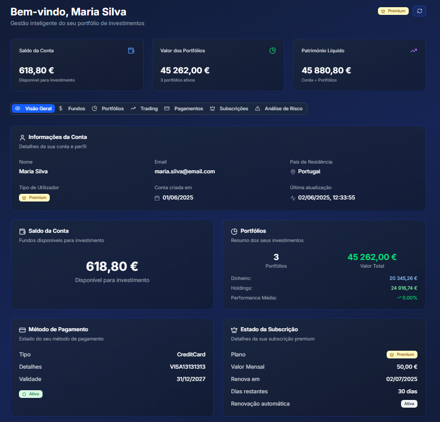
*Figura 12.4: Dashboard principal com visão geral da conta*


*Figura 12.5: Resumo detalhado de portfólios no dashboard*

#### **12.3 Gestão de Fundos**

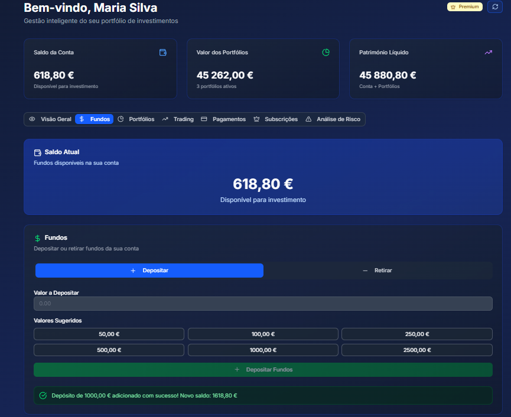
*Figura 12.6: Interface de gestão de fundos da conta*

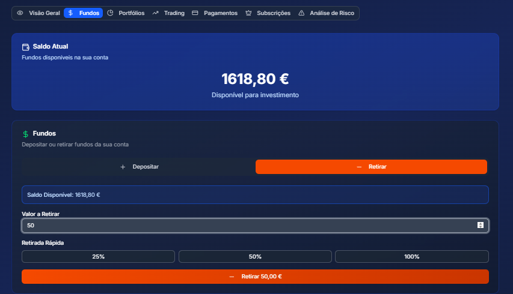
*Figura 12.7: Interface para levantamento de fundos*

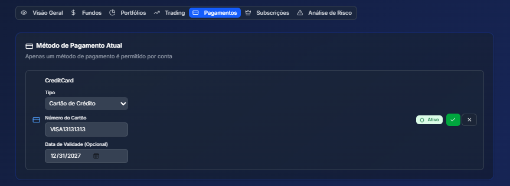
*Figura 12.8: Edição de métodos de pagamento*

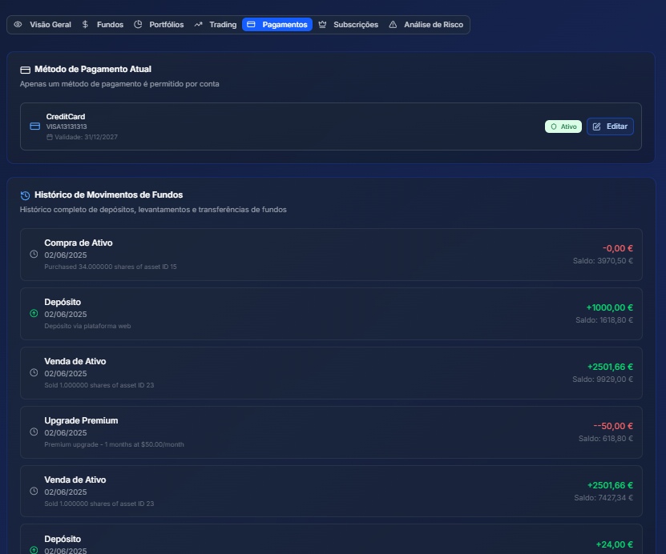
*Figura 12.9: Histórico de pagamentos e transações*

#### **12.4 Sistema de Trading**

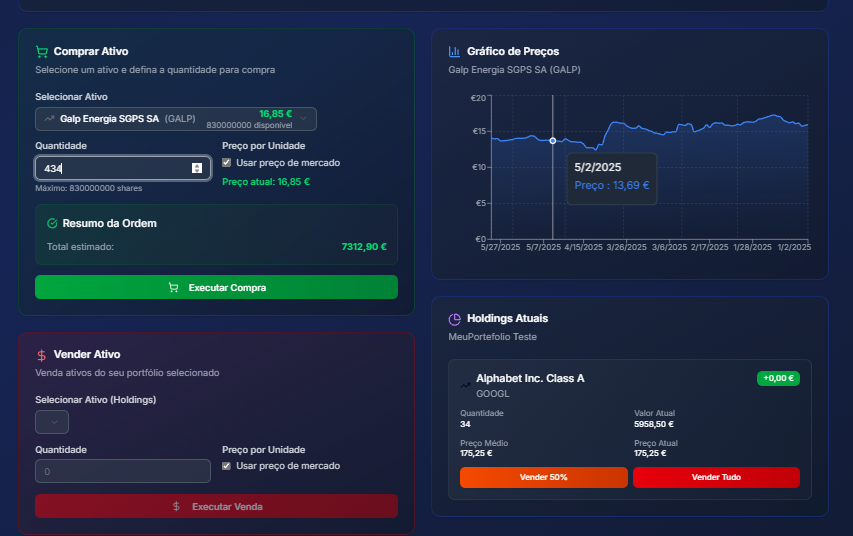
*Figura 12.10: Interface de compra de ativos no dashboard*

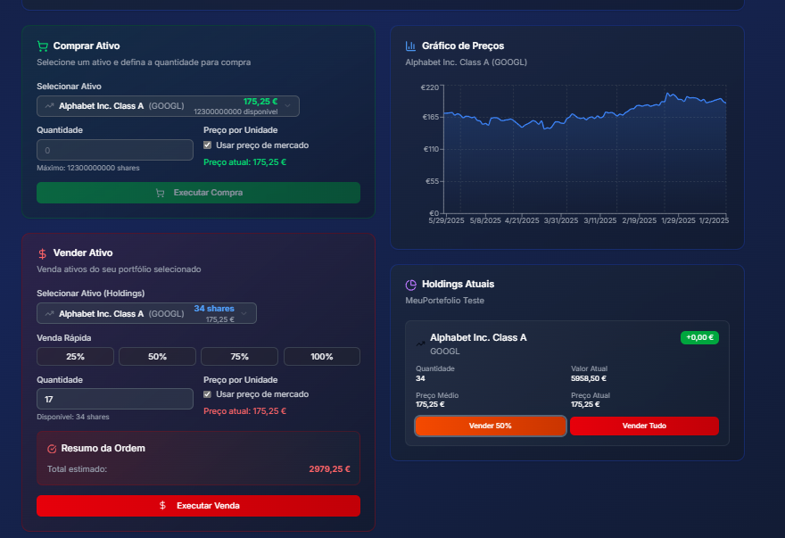
*Figura 12.11: Interface de venda de ativos no dashboard*

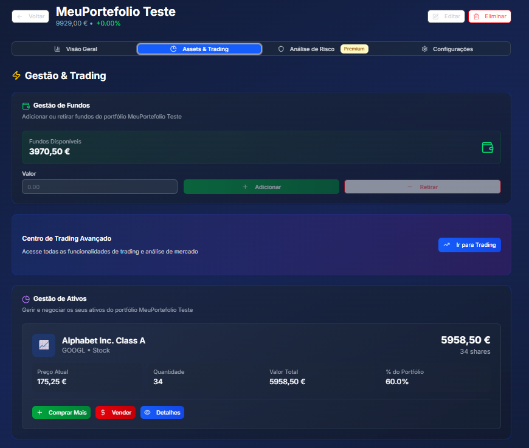
*Figura 12.12: Sistema de trading em página de portfólio*

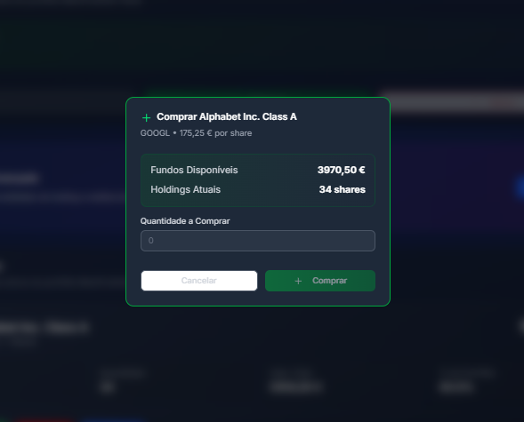
*Figura 12.13: Interface de compra em portfólio específico*

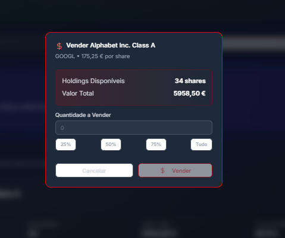
*Figura 12.14: Interface de venda em portfólio específico*

#### **12.5 Gestão de Portfólios**

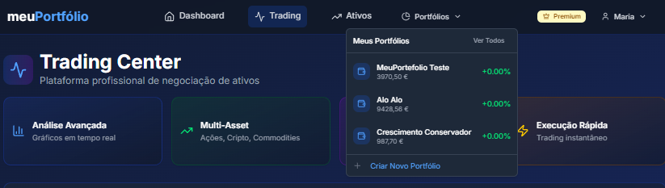
*Figura 12.15: Navegação para gestão de portfólios*

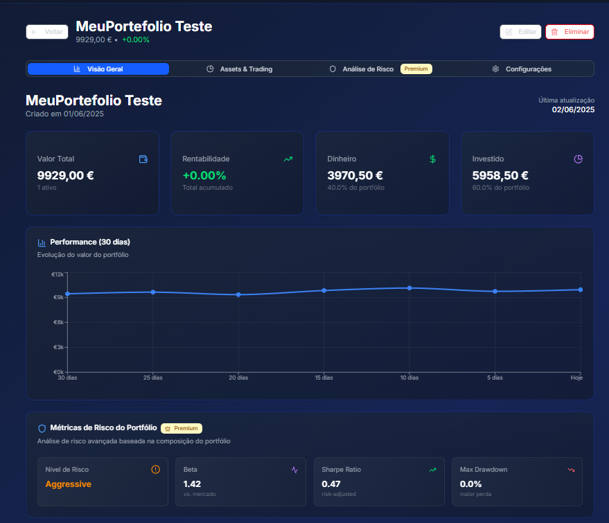
*Figura 12.16: Detalhes de portfólio - secção principal*

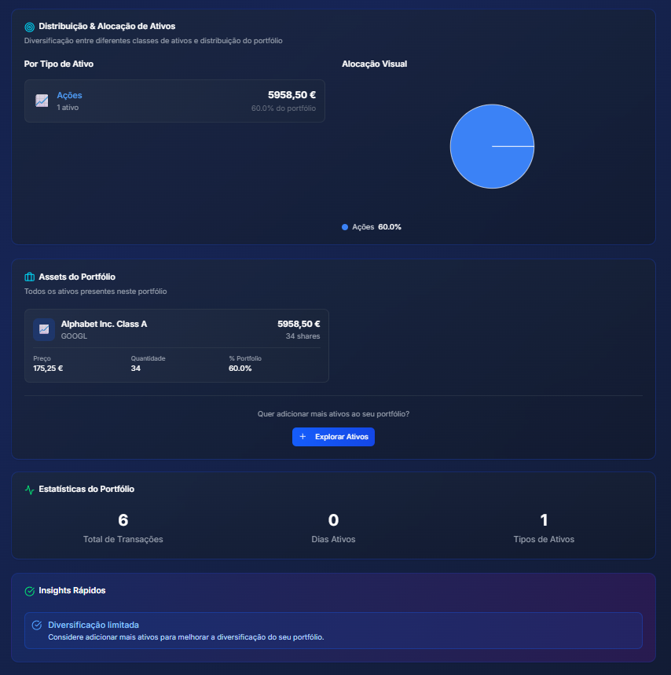
*Figura 12.17: Detalhes de portfólio - secção complementar*


*Figura 12.18: Métricas detalhadas de performance de portfólio*

#### **12.6 Gestão de Ativos**


*Figura 12.19: Lista completa de ativos disponíveis*


*Figura 12.20: Interface de ativos com filtros aplicados*


*Figura 12.21: Página detalhada de ativo individual*

#### **12.7 Gestão de Subscrições**


*Figura 12.22: Interface de subscrição para utilizadores Basic*


*Figura 12.23: Interface de subscrição para utilizadores Premium ativos*

#### **12.8 Análise de Risco**

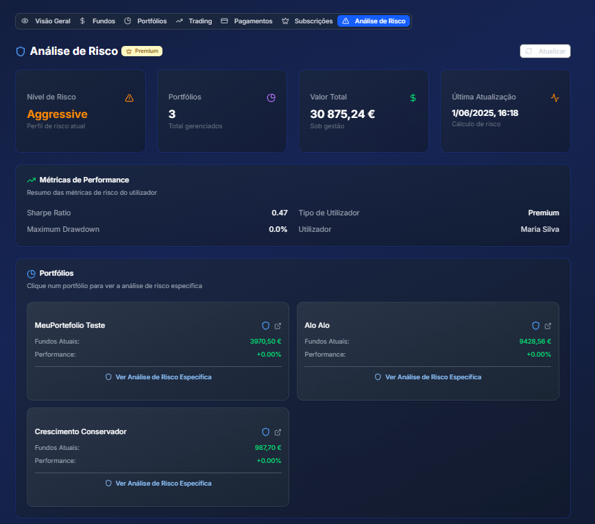
*Figura 12.24: Dashboard de análise de risco*

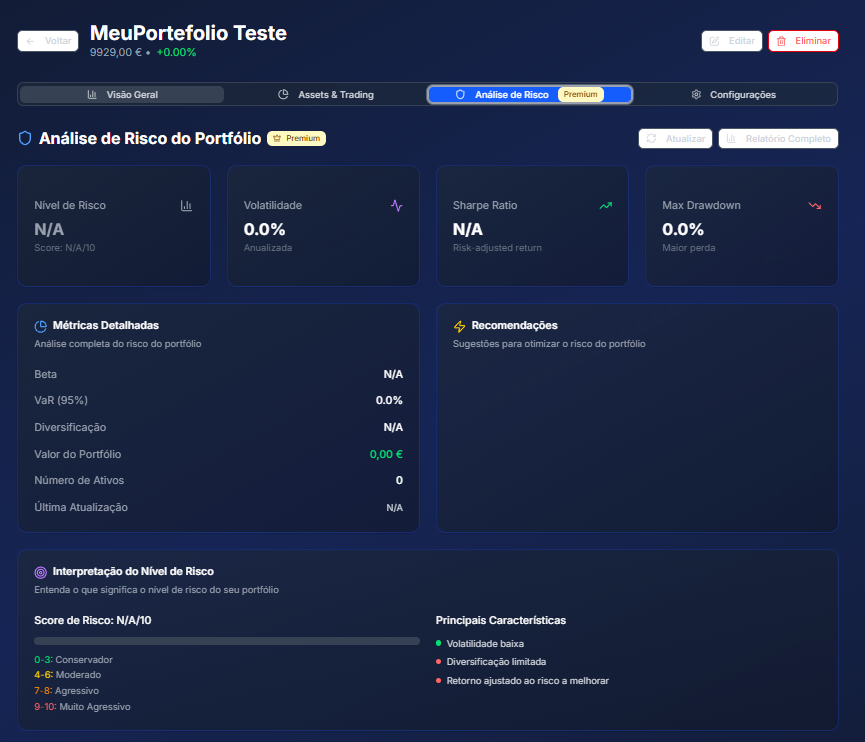
*Figura 12.25: Exemplo de análise de risco de portfólio*

