# Base de Dados 2023/2024

<p align="center">
  
</p>

<h1 align="center">meuPortefólio</h1>

<h3 align="center">Projeto de Base de Dados</h3>

<p align="center">
  <strong>Autores:</strong><br>
  Victor<br>
  Margarida
</p>

---

# Índice

1. [Sumário Executivo](#sumario-executivo)
2. [Introdução](#introducao)
   - [Visão Geral do Projeto](#visao-geral-do-projeto)
   - [Objetivo e Escopo](#objetivo-e-escopo)
   - [Partes Interessadas](#partes-interessadas)
3. [Análise de Requisitos](#analise-de-requisitos)
   - [Requisitos Funcionais](#requisitos-funcionais)
   - [Requisitos Não Funcionais](#requisitos-nao-funcionais)
   - [Requisitos de Dados](#requisitos-de-dados)
4. [Design e Implementação da Base de Dados](#design-e-implementacao-da-base-de-dados)
   - [Visão Geral do Sistema](#visao-geral-do-sistema)
   - [Entidades do Sistema](#entidades-do-sistema)
   - [Visões do Sistema](#visoes-do-sistema)
   - [Procedimentos Armazenados](#procedimentos-armazenados)
   - [Funções do Sistema](#funcoes-do-sistema)
   - [Considerações de Performance e Segurança](#consideracoes-de-performance-e-seguranca)

---
**TODO** Adcionar list de tables
**TODO** Adcionar list de figuras
---

# Sumário Executivo

O projeto meuPortefólio representa uma iniciativa inovadora no setor de investimentos, focada no desenvolvimento de uma base de dados robusta para suportar uma plataforma de gestão de portfólios com ênfase em Fractional Shares trading. Este projeto foi concebido para a disciplina de Bases de Dados, com o objetivo de criar uma solução completa que permita aos investidores gerenciar seus investimentos de forma eficiente e intuitiva.

A plataforma se destaca por oferecer funcionalidades como compra e venda de frações de ações, gestão de múltiplos tipos de ativos (ações, índices, matérias-primas e criptomoedas), e análise avançada de desempenho através de métricas especializadas. O sistema é desenvolvido utilizando Microsoft SQL Server Management Studio, 

**TODO** - > DEFINIR BACKEND (python, rust ou C#)
**TODO** - > DEFINIR FRONTEND (react, out visual studio)

# Introdução

## Visão Geral do Projeto

O meuPortefólio é uma plataforma de gestão de investimentos que visa democratizar o acesso ao mercado financeiro através do conceito de Fractional Shares. O projeto foca no desenvolvimento de uma base de dados completa que suporta todas as operações necessárias para uma gestão eficiente de portfólios de investimento.

A plataforma permite que utilizadores criem contas, depositem fundos, gerenciem múltiplos portfólios e realizem transações com diferentes tipos de ativos. O sistema também oferece funcionalidades premium que incluem análises avançadas e métricas de desempenho específicas.

## Objetivo e Escopo

### Objetivos Principais:
- Desenvolver uma base de dados completa para gestão de portfólios de investimento
- Implementar suporte para transações fracionadas de ativos
- Criar estrutura para análise e monitoramento de desempenho
- Garantir segurança e integridade dos dados dos utilizadores
- Possibilitar escalabilidade e manutenção eficiente

### Escopo do Projeto:
- Sistema de gestão de utilizadores e contas
- Módulo de gestão de portfólios
- Sistema de transações de ativos
- Monitoramento de mercado em tempo real
- Análise de desempenho e métricas
- Gestão de subscrições (Basic e Premium)

## Partes Interessadas


Os principais stakeholders do projeto meuPortefólio incluem:

1. **Investidores**: Utilizadores finais da plataforma que irão gerir seus investimentos
2. **Corretora**: Responsável pela execução das ordens e custódia dos ativos
3. **Equipe de Desenvolvimento**: Responsável pela implementação e manutenção do sistema
4. **Professores e Avaliadores**: Supervisão e avaliação do projeto acadêmico
5. **Administradores do Sistema**: Responsáveis pela gestão e monitoramento da plataforma

<div align="center">
  
</div>


---

# Análise de Requisitos

A análise de requisitos é uma fase crucial no desenvolvimento do sistema meuPortefólio, pois estabelece as bases para a implementação de uma plataforma robusta e eficiente de gestão de investimentos. Esta seção detalha os requisitos funcionais, não funcionais e de dados que guiarão o desenvolvimento do sistema, garantindo que todas as necessidades dos stakeholders sejam atendidas.

## Visão Geral dos Requisitos

O sistema meuPortefólio foi projetado para atender às necessidades de investidores que buscam uma plataforma completa para gestão de seus investimentos. Os requisitos foram categorizados em três dimensões principais:

1. **Requisitos Funcionais**: Definem as funcionalidades e operações que o sistema deve realizar
2. **Requisitos Não Funcionais**: Especificam as características de qualidade e restrições do sistema
3. **Requisitos de Dados**: Estabelecem as regras e estruturas para o gerenciamento de dados

## Requisitos Funcionais

### 1. Gestão de Utilizadores
| ID | Requisito | Descrição |
|----|-----------|-----------|
| RF1.1 | Registro de Utilizadores | O sistema deve permitir o registro de novos utilizadores com informações básicas (nome, email, país de residência, IBAN) |
| RF1.2 | Tipos de Utilizadores | O sistema deve suportar dois tipos de utilizadores: Basic e Premium |
| RF1.3 | Autenticação | O sistema deve implementar autenticação segura com hash de senhas |
| RF1.4 | Atualização de Dados | O sistema deve permitir a atualização de informações do utilizador |

### 2. Gestão de Portfólios
| ID | Requisito | Descrição |
|----|-----------|-----------|
| RF2.1 | Criação de Portfólios | O sistema deve permitir a criação de múltiplos portfólios por utilizador |
| RF2.2 | Cálculo de Fundos | O sistema deve calcular e manter atualizado o valor atual dos fundos em cada portfólio |
| RF2.3 | Métricas de Lucro | O sistema deve calcular e exibir a percentagem de lucro atual de cada portfólio |
| RF2.4 | Histórico | O sistema deve manter um histórico de todas as transações realizadas |

### 3. Gestão de Ativos
| ID | Requisito | Descrição |
|----|-----------|-----------|
| RF3.1 | Tipos de Ativos | O sistema deve suportar diferentes tipos de ativos (ações, índices, criptomoedas, matérias-primas) |
| RF3.2 | Atualização de Preços | O sistema deve manter preços atualizados para todos os ativos |
| RF3.3 | Histórico de Preços | O sistema deve armazenar histórico de preços para análise |
| RF3.4 | Detalhes Específicos | O sistema deve suportar detalhes específicos para cada tipo de ativo |

### 4. Transações
| ID | Requisito | Descrição |
|----|-----------|-----------|
| RF4.1 | Operações | O sistema deve permitir compra e venda de ativos |
| RF4.2 | Transações Fracionadas | O sistema deve suportar transações fracionadas (quantidades decimais) |
| RF4.3 | Registro de Preços | O sistema deve registrar o preço unitário de cada transação |
| RF4.4 | Histórico | O sistema deve manter um histórico completo de todas as transações |

### 5. Análise e Métricas
| ID | Requisito | Descrição |
|----|-----------|-----------|
| RF5.1 | Métricas de Risco | O sistema deve calcular métricas de risco (Maximum Drawdown, Beta, Sharpe Ratio, Retorno Absoluto) |
| RF5.2 | Resumos | O sistema deve fornecer visões resumidas dos portfólios |
| RF5.3 | Valor de Mercado | O sistema deve calcular o valor de mercado atual das posições |

## Requisitos Não Funcionais

### 1. Segurança
| ID | Requisito | Descrição |
|----|-----------|-----------|
| RNF1.1 | Armazenamento Seguro | O sistema deve armazenar senhas de forma segura usando hash (bcrypt/argon2) |
| RNF1.2 | Controle de Acesso | O sistema deve implementar controle de acesso baseado em tipos de utilizador |
| RNF1.3 | Proteção de Dados | O sistema deve proteger dados sensíveis como IBAN e informações pessoais |

### 2. Performance
| ID | Requisito | Descrição |
|----|-----------|-----------|
| RNF2.1 | Otimização | O sistema deve manter índices otimizados para consultas frequentes |
| RNF2.2 | Processamento | O sistema deve processar transações de forma eficiente |
| RNF2.3 | Tempo Real | O sistema deve manter atualizações de preços em tempo real |

### 3. Escalabilidade
| ID | Requisito | Descrição |
|----|-----------|-----------|
| RNF3.1 | Múltiplos Utilizadores | O sistema deve suportar múltiplos utilizadores e portfólios |
| RNF3.2 | Volume | O sistema deve ser capaz de lidar com grande volume de transações |
| RNF3.3 | Histórico | O sistema deve manter histórico de preços sem degradação de performance |

### 4. Integridade dos Dados
| ID | Requisito | Descrição |
|----|-----------|-----------|
| RNF4.1 | Consistência | O sistema deve garantir consistência nas transações usando transações ACID |
| RNF4.2 | Timestamps | O sistema deve manter timestamps de criação e atualização em registros importantes |
| RNF4.3 | Triggers | O sistema deve implementar triggers para atualização automática de timestamps |

### 5. Manutenibilidade
| ID | Requisito | Descrição |
|----|-----------|-----------|
| RNF5.1 | Procedimentos | O sistema deve usar procedimentos armazenados para operações complexas |
| RNF5.2 | Views | O sistema deve implementar views para consultas comuns |
| RNF5.3 | Funções | O sistema deve manter funções auxiliares para cálculos recorrentes |

## Requisitos de Dados

### 1. Estrutura de Dados
| ID | Requisito | Descrição |
|----|-----------|-----------|
| RD1.1 | Organização | O sistema deve manter um esquema organizado com separação clara de responsabilidades |
| RD1.2 | Relacionamentos | O sistema deve implementar relacionamentos apropriados entre entidades |
| RD1.3 | Tipos de Dados | O sistema deve usar tipos de dados apropriados para cada campo |

### 2. Validação de Dados
| ID | Requisito | Descrição |
|----|-----------|-----------|
| RD2.1 | Tipos de Utilizador | O sistema deve validar tipos de utilizador (Basic/Premium) |
| RD2.2 | Tipos de Ativos | O sistema deve validar tipos de ativos (Company/Index/Cryptocurrency/Commodity) |
| RD2.3 | Tipos de Transações | O sistema deve validar tipos de transações (Buy/Sell) |

### 3. Armazenamento de Dados
| ID | Requisito | Descrição |
|----|-----------|-----------|
| RD3.1 | Precisão | O sistema deve armazenar valores monetários com precisão decimal apropriada |
| RD3.2 | Histórico | O sistema deve manter histórico de preços para análise temporal |
| RD3.3 | Auditoria | O sistema deve armazenar timestamps para auditoria e rastreamento |

# Design e Implementação da Base de Dados

## Visão Geral do Sistema

### Diagrama Conceitual

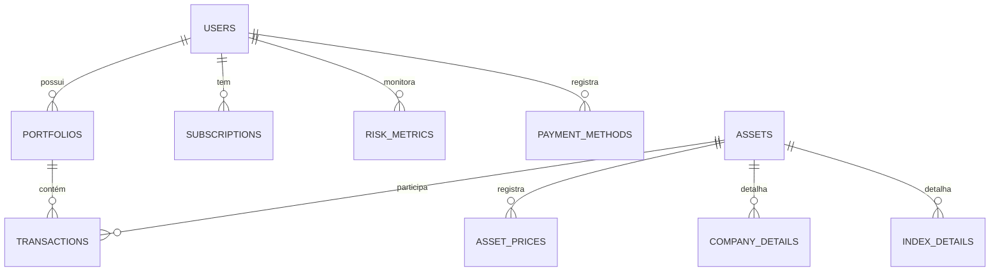
*Figura 1: Diagrama ER conceitual do sistema meuPortefólio mostrando as principais entidades e seus relacionamentos*

### Diagrama de Implementação

<div align="center">
  
</div>

*Figura 2: Diagrama de implementação do banco de dados gerado pelo SQL Server Management Studio, mostrando a estrutura física das tabelas e seus relacionamentos*

O diagrama de implementação acima mostra a estrutura real do banco de dados conforme implementado no SQL Server, incluindo:
- Todas as tabelas do schema `portfolio`
- Relacionamentos e chaves estrangeiras entre as tabelas
- Campos e tipos de dados de cada tabela
- Cardinalidade das relações

## Entidades do Sistema

### 1. Users (Utilizadores)

#### Descrição Conceitual
A entidade Users representa os utilizadores da plataforma meuPortefólio, sendo a entidade central do sistema. Cada utilizador pode ter múltiplos portfólios, uma subscrição ativa e diferentes níveis de acesso (Basic/Premium).

#### Atributos e Constraints
*Tabela 1: Atributos e regras da entidade Users*
| Atributo | Tipo | Descrição | Regras |
|----------|------|-----------|---------|
| UserID | UNIQUEIDENTIFIER | Identificador único do utilizador | PK, DEFAULT NEWID() |
| Name | NVARCHAR(100) | Nome completo do utilizador | NOT NULL |
| Email | NVARCHAR(100) | Email do utilizador | NOT NULL, UNIQUE |
| PasswordHash | CHAR(60) | Hash da senha do utilizador | NOT NULL |
| CountryOfResidence | NVARCHAR(100) | País de residência | NOT NULL |
| IBAN | NVARCHAR(34) | Número da conta bancária | NOT NULL |
| UserType | NVARCHAR(20) | Tipo de utilizador (Basic/Premium) | NOT NULL, CHECK |
| CreatedAt | DATETIME | Data de criação do registro | NOT NULL, DEFAULT |
| UpdatedAt | DATETIME | Data da última atualização | NOT NULL, DEFAULT |

#### Relacionamentos
*Tabela 2: Relacionamentos da entidade Users*
| Entidade Relacionada | Tipo | Descrição |
|---------------------|------|------------|
| Portfolios | 1:N | Um utilizador pode ter múltiplos portfólios |
| Subscriptions | 1:1 | Um utilizador pode ter uma subscrição ativa |
| RiskMetrics | 1:N | Um utilizador tem múltiplas métricas de risco |
| PaymentMethods | 1:N | Um utilizador pode ter múltiplos métodos de pagamento |

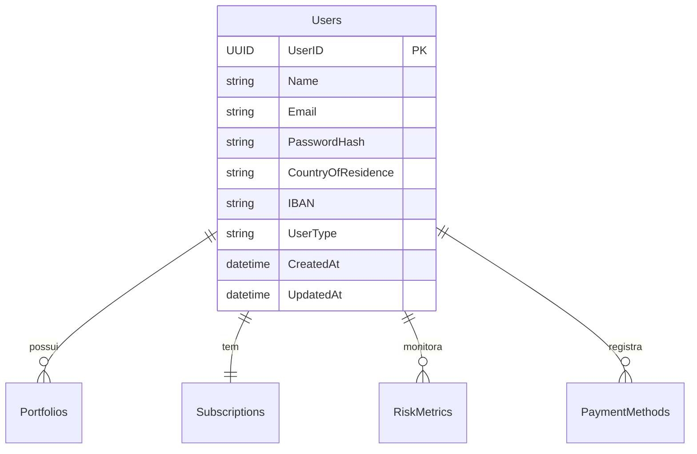
*Figura 1: Diagrama ER da entidade Users e seus relacionamentos*

### 2. Portfolios (Portfólios)

#### Descrição Conceitual
Representa as carteiras de investimento dos utilizadores, agregando todas as transações e mantém registro do desempenho e lucro. Cada portfólio pode conter múltiplos ativos e mantém registro do desempenho e lucro.

#### Atributos e Constraints
*Tabela 3: Atributos e regras da entidade Portfolios*
| Atributo | Tipo | Descrição | Regras |
|----------|------|-----------|---------|
| PortfolioID | INT | Identificador único do portfólio | PK, IDENTITY |
| UserID | UNIQUEIDENTIFIER | ID do utilizador proprietário | FK, NOT NULL |
| Name | NVARCHAR(100) | Nome do portfólio | NOT NULL |
| CreationDate | DATETIME | Data de criação | NOT NULL, DEFAULT |
| CurrentFunds | DECIMAL(18,2) | Saldo atual | NOT NULL, DEFAULT 0 |
| CurrentProfitPct | DECIMAL(10,2) | Percentagem de lucro atual | NOT NULL, DEFAULT 0 |
| LastUpdated | DATETIME | Data da última atualização | NOT NULL, DEFAULT |

#### Relacionamentos
*Tabela 4: Relacionamentos da entidade Portfolios*
| Entidade Relacionada | Tipo | Descrição |
|---------------------|------|------------|
| Users | N:1 | Cada portfólio pertence a um utilizador |
| Transactions | 1:N | Um portfólio contém múltiplas transações |

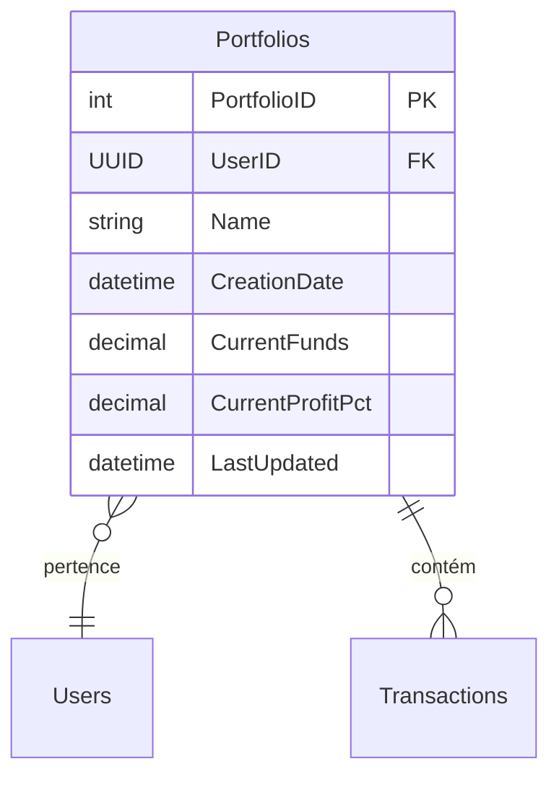
*Figura 2: Diagrama ER da entidade Portfolios e seus relacionamentos*

### 3. Assets (Ativos)

#### Descrição Conceitual
Representa os diferentes tipos de instrumentos financeiros disponíveis para investimento, incluindo ações, índices, criptomoedas e commodities. Mantém informações atualizadas sobre preços e volume de negociação.

#### Atributos e Constraints
*Tabela 5: Atributos e regras da entidade Assets*
| Atributo | Tipo | Descrição | Regras |
|----------|------|-----------|---------|
| AssetID | INT | Identificador único do ativo | PK, IDENTITY |
| Name | NVARCHAR(100) | Nome do ativo | NOT NULL |
| Symbol | NVARCHAR(20) | Símbolo/ticker do ativo | NOT NULL, UNIQUE |
| AssetType | NVARCHAR(20) | Tipo do ativo | NOT NULL, CHECK |
| Price | DECIMAL(18,2) | Preço atual | NOT NULL |
| Volume | BIGINT | Volume de negociação | NOT NULL |
| AvailableShares | DECIMAL(18,6) | Quantidade disponível | NOT NULL |
| LastUpdated | DATETIME | Última atualização | NOT NULL, DEFAULT |

#### Relacionamentos
*Tabela 6: Relacionamentos da entidade Assets*
| Entidade Relacionada | Tipo | Descrição |
|---------------------|------|------------|
| AssetPrices | 1:N | Um ativo tem múltiplos registros de preço |
| Transactions | 1:N | Um ativo participa em múltiplas transações |
| CompanyDetails | 1:0/1 | Um ativo pode ter detalhes de empresa |
| IndexDetails | 1:0/1 | Um ativo pode ter detalhes de índice |

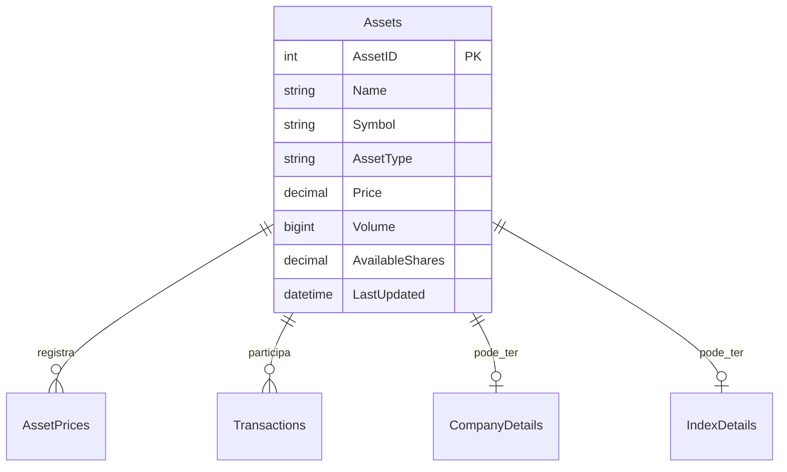
*Figura 3: Diagrama ER da entidade Assets e seus relacionamentos*

### 4. Transactions (Transações)

#### Descrição Conceitual
Registra todas as operações de compra e venda realizadas nos portfólios, mantendo o histórico completo de negociações. Cada transação está associada a um portfólio específico e mantém informações sobre quantidade, preço e momento da operação.

#### Atributos e Constraints
*Tabela 7: Atributos e regras da entidade Transactions*
| Atributo | Tipo | Descrição | Regras |
|----------|------|-----------|---------|
| TransactionID | BIGINT | Identificador único da transação | PK, IDENTITY |
| UserID | UNIQUEIDENTIFIER | ID do utilizador | FK, NOT NULL |
| PortfolioID | INT | ID do portfólio | FK, NOT NULL |
| AssetID | INT | ID do ativo | FK, NOT NULL |
| TransactionType | NVARCHAR(10) | Tipo da transação (Buy/Sell) | NOT NULL, CHECK |
| Quantity | DECIMAL(18,6) | Quantidade negociada | NOT NULL |
| UnitPrice | DECIMAL(18,4) | Preço unitário | NOT NULL |
| TransactionDate | DATETIME | Data da transação | NOT NULL, DEFAULT |
| Status | NVARCHAR(20) | Status da transação | NOT NULL, DEFAULT |

#### Relacionamentos
*Tabela 8: Relacionamentos da entidade Transactions*
| Entidade Relacionada | Tipo | Descrição |
|---------------------|------|------------|
| Users | N:1 | Cada transação pertence a um utilizador |
| Portfolios | N:1 | Cada transação pertence a um portfólio |
| Assets | N:1 | Cada transação envolve um ativo |

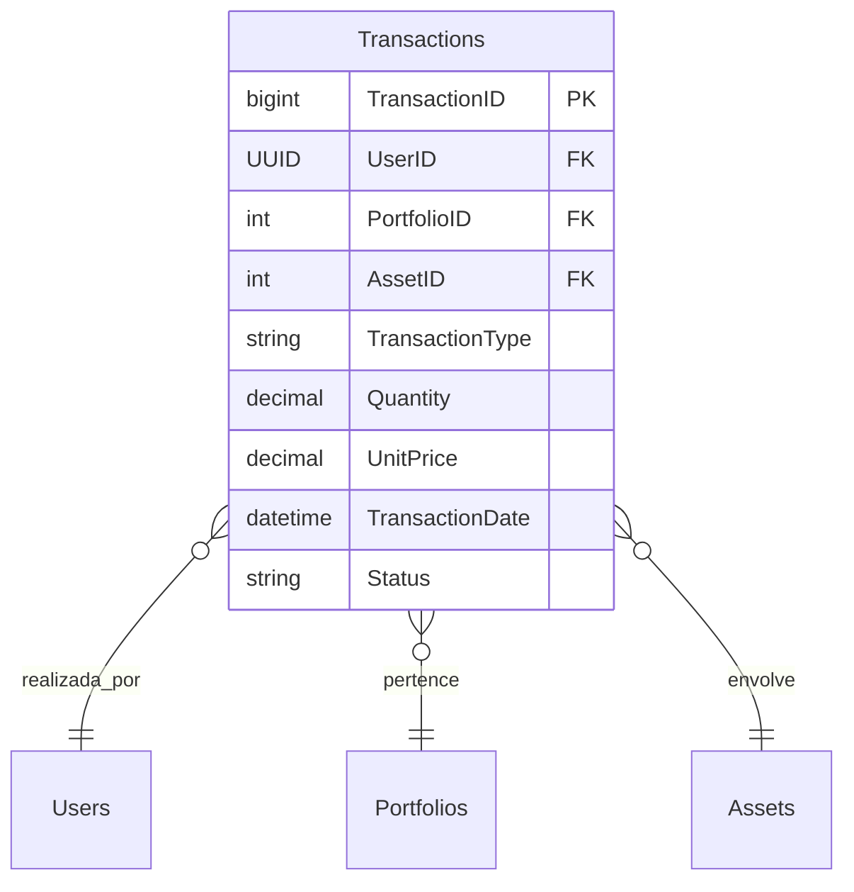
*Figura 4: Diagrama ER da entidade Transactions e seus relacionamentos*

### 5. AssetPrices (Preços dos Ativos)

#### Descrição Conceitual
Mantém o histórico completo de preços para cada ativo, permitindo análises históricas e cálculos de desempenho. Os registros são atualizados em tempo real e mantêm informações sobre variações de preço ao longo do tempo.

#### Atributos e Constraints
*Tabela 9: Atributos e regras da entidade AssetPrices*
| Atributo | Tipo | Descrição | Regras |
|----------|------|-----------|---------|
| PriceID | BIGINT | Identificador único do registro | PK, IDENTITY |
| AssetID | INT | ID do ativo | FK, NOT NULL |
| Price | DECIMAL(18,2) | Preço registrado | NOT NULL |
| AsOf | DATETIME | Data/hora do registro | NOT NULL, DEFAULT |
| OpenPrice | DECIMAL(18,2) | Preço de abertura | NOT NULL |
| HighPrice | DECIMAL(18,2) | Preço mais alto | NOT NULL |
| LowPrice | DECIMAL(18,2) | Preço mais baixo | NOT NULL |
| Volume | BIGINT | Volume negociado | NOT NULL |

#### Relacionamentos
*Tabela 10: Relacionamentos da entidade AssetPrices*
| Entidade Relacionada | Tipo | Descrição |
|---------------------|------|------------|
| Assets | N:1 | Cada registro de preço pertence a um ativo |

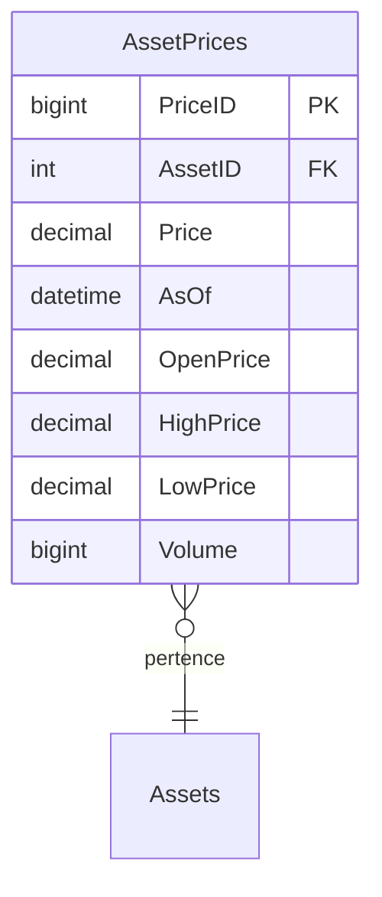
*Figura 5: Diagrama ER da entidade AssetPrices e seus relacionamentos*

### 6. Subscriptions (Subscrições)

#### Descrição Conceitual
Gerencia as subscrições premium dos utilizadores, controlando o acesso a funcionalidades avançadas da plataforma. Cada utilizador pode ter apenas uma subscrição ativa por vez, com datas de início e fim definidas e histórico de pagamentos.

#### Atributos e Constraints
*Tabela 11: Atributos e regras da entidade Subscriptions*
| Atributo | Tipo | Descrição | Regras |
|----------|------|-----------|---------|
| SubscriptionID | INT | Identificador único da subscrição | PK, IDENTITY |
| UserID | UNIQUEIDENTIFIER | ID do utilizador | FK, NOT NULL, UNIQUE |
| StartDate | DATETIME | Data de início da subscrição | NOT NULL |
| EndDate | DATETIME | Data de término da subscrição | NOT NULL |
| AmountPaid | DECIMAL(18,2) | Valor pago pela subscrição | NOT NULL |
| PaymentStatus | NVARCHAR(20) | Status do pagamento | NOT NULL, DEFAULT |
| CreatedAt | DATETIME | Data de criação | NOT NULL, DEFAULT |
| UpdatedAt | DATETIME | Data de atualização | NOT NULL, DEFAULT |

#### Relacionamentos
*Tabela 12: Relacionamentos da entidade Subscriptions*
| Entidade Relacionada | Tipo | Descrição |
|---------------------|------|------------|
| Users | 1:1 | Cada subscrição pertence a um único utilizador |

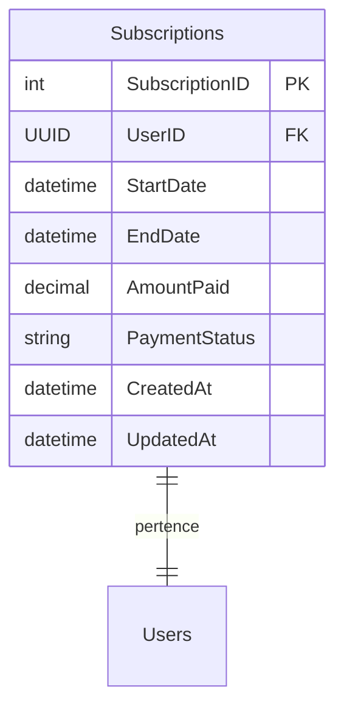
*Figura 6: Diagrama ER da entidade Subscriptions e seus relacionamentos*

### 7. RiskMetrics (Métricas de Risco)

#### Descrição Conceitual
Armazena e monitora métricas de risco calculadas para cada utilizador, fornecendo insights importantes sobre o desempenho e risco dos investimentos. As métricas são calculadas periodicamente e mantêm um histórico para análise temporal e tomada de decisão.

#### Atributos e Constraints
*Tabela 13: Atributos e regras da entidade RiskMetrics*
| Atributo | Tipo | Descrição | Regras |
|----------|------|-----------|---------|
| MetricID | INT | Identificador único da métrica | PK, IDENTITY |
| UserID | UNIQUEIDENTIFIER | ID do utilizador | FK, NOT NULL |
| MaximumDrawdown | DECIMAL(10,2) | Maior queda histórica | NULL |
| Beta | DECIMAL(10,2) | Volatilidade relativa ao mercado | NULL |
| SharpeRatio | DECIMAL(10,2) | Retorno ajustado ao risco | NULL |
| AbsoluteReturn | DECIMAL(10,2) | Retorno absoluto | NULL |
| VolatilityScore | DECIMAL(10,2) | Pontuação de volatilidade | NULL |
| RiskLevel | NVARCHAR(20) | Nível de risco calculado | NOT NULL |
| CapturedAt | DATETIME | Data do cálculo | NOT NULL, DEFAULT |

#### Relacionamentos
*Tabela 14: Relacionamentos da entidade RiskMetrics*
| Entidade Relacionada | Tipo | Descrição |
|---------------------|------|------------|
| Users | N:1 | Cada métrica pertence a um utilizador |

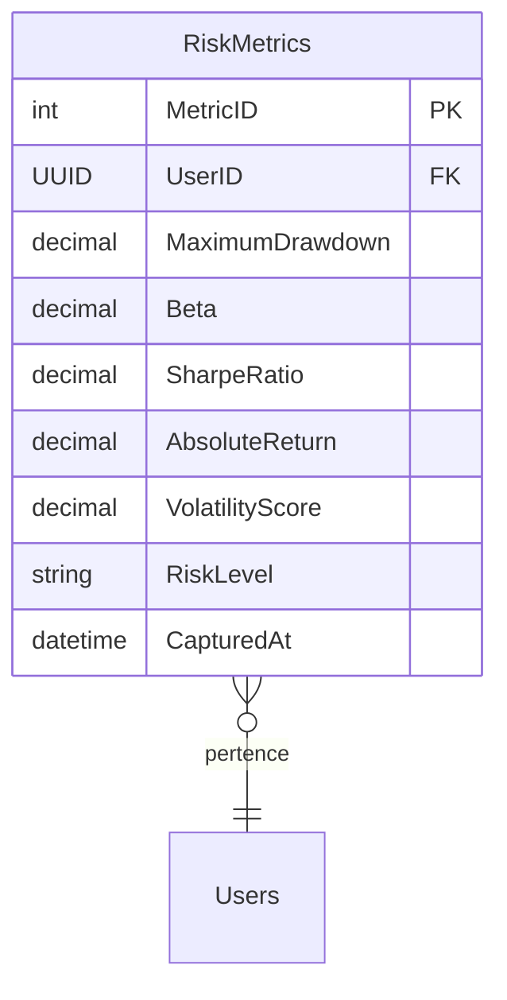
*Figura 7: Diagrama ER da entidade RiskMetrics e seus relacionamentos*

### 8. CompanyDetails (Detalhes de Empresas)

#### Descrição Conceitual
Armazena informações específicas para ativos do tipo empresa, como setor de atuação, indústria e país de origem. Esta entidade estende a entidade Assets para ativos do tipo 'Company', fornecendo detalhes adicionais específicos para análise fundamentalista.

#### Atributos e Constraints
*Tabela 15: Atributos e regras da entidade CompanyDetails*
| Atributo | Tipo | Descrição | Regras |
|----------|------|-----------|---------|
| AssetID | INT | ID do ativo (empresa) | PK, FK |
| Sector | NVARCHAR(100) | Setor de atuação | NOT NULL |
| Industry | NVARCHAR(100) | Indústria específica | NOT NULL |
| Country | NVARCHAR(100) | País de origem | NOT NULL |
| MarketCap | DECIMAL(18,2) | Capitalização de mercado | NOT NULL |
| EmployeeCount | INT | Número de funcionários | NULL |
| YearFounded | INT | Ano de fundação | NULL |
| LastUpdated | DATETIME | Última atualização | NOT NULL, DEFAULT |

#### Relacionamentos
*Tabela 16: Relacionamentos da entidade CompanyDetails*
| Entidade Relacionada | Tipo | Descrição |
|---------------------|------|------------|
| Assets | 1:1 | Cada detalhe pertence a um ativo do tipo empresa |

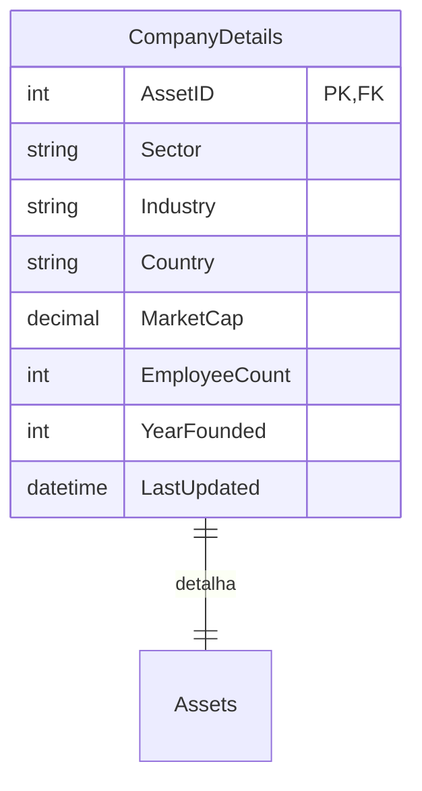
*Figura 8: Diagrama ER da entidade CompanyDetails e seus relacionamentos*

### 9. IndexDetails (Detalhes de Índices)

#### Descrição Conceitual
Mantém informações específicas para ativos do tipo índice, incluindo país ou região de referência, metodologia de cálculo e componentes. Esta entidade estende a entidade Assets para ativos do tipo 'Index', fornecendo detalhes essenciais para análise de mercado e benchmarking.

#### Atributos e Constraints
*Tabela 17: Atributos e regras da entidade IndexDetails*
| Atributo | Tipo | Descrição | Regras |
|----------|------|-----------|---------|
| AssetID | INT | ID do ativo (índice) | PK, FK |
| Country | NVARCHAR(100) | País do índice | NOT NULL |
| Region | NVARCHAR(100) | Região geográfica | NOT NULL |
| Methodology | NVARCHAR(MAX) | Metodologia de cálculo | NOT NULL |
| NumberOfComponents | INT | Número de componentes | NOT NULL |
| RebalanceFrequency | NVARCHAR(50) | Frequência de rebalanceamento | NOT NULL |
| BaseValue | DECIMAL(18,2) | Valor base do índice | NOT NULL |
| BaseDate | DATE | Data base do índice | NOT NULL |
| LastUpdated | DATETIME | Última atualização | NOT NULL, DEFAULT |

#### Relacionamentos
*Tabela 18: Relacionamentos da entidade IndexDetails*
| Entidade Relacionada | Tipo | Descrição |
|---------------------|------|------------|
| Assets | 1:1 | Cada detalhe pertence a um ativo do tipo índice |

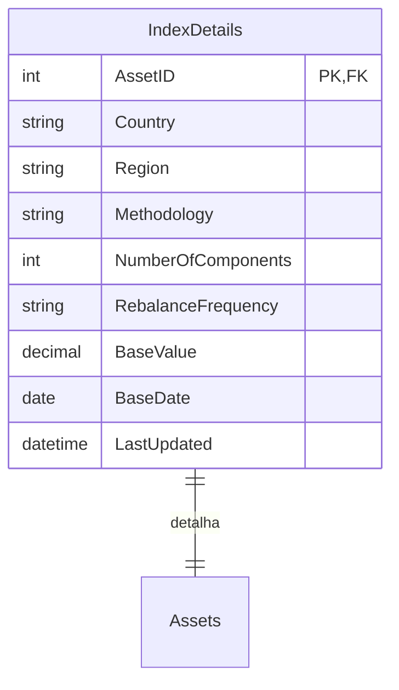
*Figura 9: Diagrama ER da entidade IndexDetails e seus relacionamentos*

### 10. PaymentMethods (Métodos de Pagamento)

#### Descrição Conceitual
Gerencia os diferentes métodos de pagamento registrados pelos utilizadores para operações na plataforma. Suporta múltiplos tipos de pagamento como cartões de crédito/débito, transferências bancárias e criptomoedas, mantendo as informações de forma segura e criptografada, com histórico de utilização.

#### Atributos e Constraints
*Tabela 19: Atributos e regras da entidade PaymentMethods*
| Atributo | Tipo | Descrição | Regras |
|----------|------|-----------|---------|
| PaymentMethodID | INT | Identificador único do método | PK, IDENTITY |
| UserID | UNIQUEIDENTIFIER | ID do utilizador | FK, NOT NULL |
| MethodType | NVARCHAR(50) | Tipo do método de pagamento | NOT NULL |
| Details | NVARCHAR(255) | Detalhes do método (criptografado) | NOT NULL |
| IsDefault | BIT | Indica se é o método padrão | NOT NULL, DEFAULT(0) |
| LastUsed | DATETIME | Última utilização | NULL |
| Status | NVARCHAR(20) | Status do método de pagamento | NOT NULL, DEFAULT |
| ValidationDate | DATE | Data de validação | NOT NULL |
| CreatedAt | DATETIME | Data de criação | NOT NULL, DEFAULT |
| UpdatedAt | DATETIME | Data de atualização | NOT NULL, DEFAULT |

#### Relacionamentos
*Tabela 20: Relacionamentos da entidade PaymentMethods*
| Entidade Relacionada | Tipo | Descrição |
|---------------------|------|------------|
| Users | N:1 | Cada método de pagamento pertence a um utilizador |

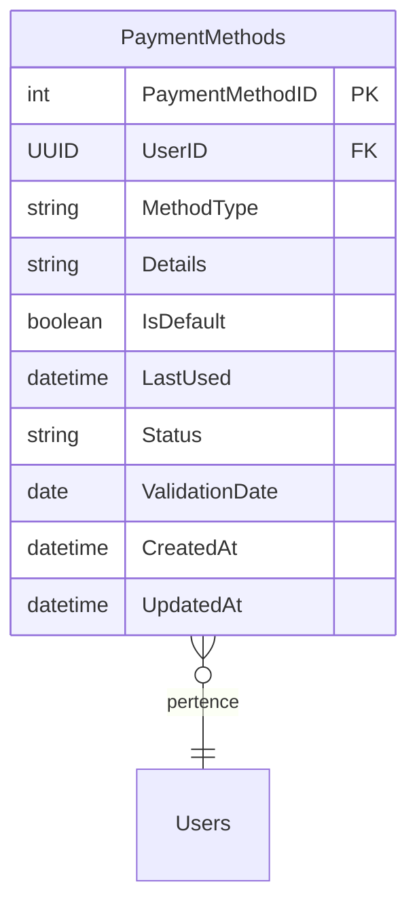
*Figura 10: Diagrama ER da entidade PaymentMethods e seus relacionamentos*

## Views do Sistema

O sistema meuPortefólio implementa um conjunto de views otimizadas para fornecer acesso rápido e eficiente às informações mais frequentemente consultadas. Estas views são fundamentais para a performance do sistema e para facilitar a geração de relatórios e análises.

### 1. Portfolio Summary (vw_PortfolioSummary)

#### Descrição Conceitual
Fornece uma visão resumida de cada portfólio, incluindo informações sobre o proprietário, valor atual, lucro e número total de transações. Esta view é fundamental para dashboards e relatórios rápidos sobre o estado dos portfólios.

#### Campos Principais
*Tabela 21: Campos principais da view vw_PortfolioSummary*
| Campo | Tipo | Descrição |
|-------|------|-----------|
| PortfolioID | INT | Identificador do portfólio |
| PortfolioName | NVARCHAR(100) | Nome do portfólio |
| Owner | NVARCHAR(100) | Nome do proprietário |
| CurrentFunds | DECIMAL(18,2) | Saldo atual do portfólio |
| CurrentProfitPct | DECIMAL(10,2) | Percentagem de lucro atual |
| TotalTrades | INT | Número total de transações |

### 2. Asset Holdings (vw_AssetHoldings)

#### Descrição Conceitual
Apresenta uma visão consolidada das posições atuais em cada ativo por portfólio, calculando a quantidade total mantida e o valor de mercado atual. Esta view é essencial para análise de portfólio e tomada de decisões de investimento.

#### Campos Principais
*Tabela 22: Campos principais da view vw_AssetHoldings*
| Campo | Tipo | Descrição |
|-------|------|-----------|
| PortfolioID | INT | Identificador do portfólio |
| AssetName | NVARCHAR(100) | Nome do ativo |
| Symbol | NVARCHAR(20) | Símbolo do ativo |
| QuantityHeld | DECIMAL(18,6) | Quantidade total mantida |
| MarketValue | DECIMAL(18,2) | Valor de mercado da posição |

### 3. Risk Analysis (vw_RiskAnalysis)

#### Descrição Conceitual
Fornece uma visão consolidada das métricas de risco mais recentes para cada utilizador, combinando informações de portfólio com métricas de risco. Esta view é crucial para monitoramento de risco e conformidade.

#### Campos Principais
*Tabela 23: Campos principais da view vw_RiskAnalysis*
| Campo | Tipo | Descrição |
|-------|------|-----------|
| UserName | NVARCHAR(100) | Nome do utilizador |
| TotalPortfolios | INT | Número total de portfólios |
| TotalInvestment | DECIMAL(18,2) | Valor total investido |
| RiskLevel | NVARCHAR(20) | Nível de risco calculado |
| SharpeRatio | DECIMAL(10,2) | Índice de Sharpe |

### 4. Asset Price History (vw_AssetPriceHistory)

#### Descrição Conceitual
Apresenta o histórico de preços dos ativos com variações percentuais e médias móveis. Esta view é essencial para análise técnica e visualização de tendências de preços.

#### Campos Principais
*Tabela 24: Campos principais da view vw_AssetPriceHistory*
| Campo | Tipo | Descrição |
|-------|------|-----------|
| Symbol | NVARCHAR(20) | Símbolo do ativo |
| PriceDate | DATETIME | Data do registro |
| OpenPrice | DECIMAL(18,2) | Preço de abertura |
| ClosePrice | DECIMAL(18,2) | Preço de fechamento |
| DailyChange | DECIMAL(10,2) | Variação percentual diária |

### Benefícios e Uso

As views implementadas fornecem diversos benefícios ao sistema:

1. **Performance Otimizada**
   - Consultas complexas pré-definidas
   - Dados agregados prontos para uso
   - Redução de processamento em tempo real

2. **Facilidade de Uso**
   - Interface simplificada para consultas comuns
   - Padronização de cálculos e métricas
   - Redução de código duplicado

3. **Manutenibilidade**
   - Lógica de negócio centralizada
   - Facilidade de modificação
   - Consistência nas consultas

4. **Segurança**
   - Controle de acesso granular
   - Exposição controlada dos dados
   - Proteção contra consultas mal formuladas

A implementação completa das views pode ser encontrada no arquivo `002_views.sql`.

## Procedimentos Armazenados

Para garantir a integridade e consistência das operações na base de dados, implementamos um conjunto básico de procedimentos armazenados. Por questões didáticas, focamos nos procedimentos fundamentais que demonstram os principais conceitos de manipulação de dados e controle transacional.

### Procedimentos Implementados

*Tabela 25: Procedimentos Armazenados*
| Procedimento | Função | Implementado |
|--------------|--------|--------------|
| sp_CreateUser | Inserção de utilizador com validações básicas | Sim |
| sp_CreatePortfolio | Criação de portfólio associado a um utilizador | Sim |
| sp_ExecuteTransaction | Registro de operações de compra/venda | Sim |
| sp_UpdateAssetPrice | Atualização de preços com histórico | Sim |
| sp_import_asset_price | Importação de preços históricos com dados OHLCV | Sim |
| sp_ensure_asset | Criação ou obtenção de ativos existentes | Sim |

### Detalhamento dos Procedimentos

#### 1. sp_CreateUser
```sql
CREATE PROCEDURE portfolio.sp_CreateUser (
    @Name NVARCHAR(100),
    @Email NVARCHAR(100),
    @PasswordHash CHAR(60),
    @CountryOfResidence NVARCHAR(100),
    @IBAN NVARCHAR(34),
    @UserType NVARCHAR(20)
)
```