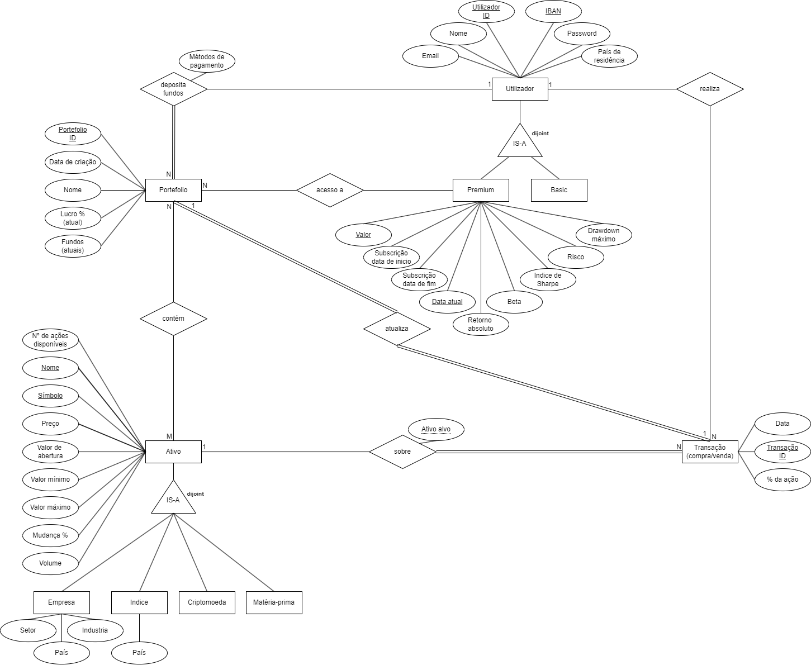

# Base de Dados 2023/2024

  

<h1 align="center">meuPortefólio</h1>

<h3 align="center">Projeto de Base de Dados</h3>

  <strong>Autores:</strong> 
  Victor 
  Margarida

---

# Índice

1. [Sumário Executivo](#sumario-executivo)
2. [Introdução](#introducao)
   - [Visão Geral do Projeto](#visao-geral-do-projeto)
   - [Objetivo e Escopo](#objetivo-e-escopo)
   - [Partes Interessadas](#partes-interessadas)
3. [Análise de Requisitos](#analise-de-requisitos)
   - [Requisitos Funcionais](#requisitos-funcionais)
   - [Requisitos Não Funcionais](#requisitos-nao-funcionais)
   - [Requisitos de Dados](#requisitos-de-dados)
4. [Design da Base de Dados](#design-da-base-de-dados)
   - [Modelo de Dados Conceitual](#modelo-de-dados-conceitual)
   - [Modelo de Dados Lógico](#modelo-de-dados-logico)
   - [Modelo de Dados Físico](#modelo-de-dados-fisico)

---
**TODO** Adcionar list de tables
**TODO** Adcionar list de figuras
---

# Sumário Executivo

O projeto meuPortefólio representa uma iniciativa inovadora no setor de investimentos, focada no desenvolvimento de uma base de dados robusta para suportar uma plataforma de gestão de portfólios com ênfase em Fractional Shares trading. Este projeto foi concebido para a disciplina de Bases de Dados, com o objetivo de criar uma solução completa que permita aos investidores gerenciar seus investimentos de forma eficiente e intuitiva.

A plataforma se destaca por oferecer funcionalidades como compra e venda de frações de ações, gestão de múltiplos tipos de ativos (ações, índices, matérias-primas e criptomoedas), e análise avançada de desempenho através de métricas especializadas. O sistema é desenvolvido utilizando Microsoft SQL Server Management Studio, 

**TODO** - > DEFINIR BACKEND (python, rust ou C#)
**TODO** - > DEFINIR FRONTEND (react, out visual studio)

# Introdução

## Visão Geral do Projeto

O meuPortefólio é uma plataforma de gestão de investimentos que visa democratizar o acesso ao mercado financeiro através do conceito de Fractional Shares. O projeto foca no desenvolvimento de uma base de dados completa que suporta todas as operações necessárias para uma gestão eficiente de portfólios de investimento.

A plataforma permite que utilizadores criem contas, depositem fundos, gerenciem múltiplos portfólios e realizem transações com diferentes tipos de ativos. O sistema também oferece funcionalidades premium que incluem análises avançadas e métricas de desempenho específicas.

## Objetivo e Escopo

### Objetivos Principais:
- Desenvolver uma base de dados completa para gestão de portfólios de investimento
- Implementar suporte para transações fracionadas de ativos
- Criar estrutura para análise e monitoramento de desempenho
- Garantir segurança e integridade dos dados dos utilizadores
- Possibilitar escalabilidade e manutenção eficiente

### Escopo do Projeto:
- Sistema de gestão de utilizadores e contas
- Módulo de gestão de portfólios
- Sistema de transações de ativos
- Monitoramento de mercado em tempo real
- Análise de desempenho e métricas
- Gestão de subscrições (Basic e Premium)

## Partes Interessadas

Os principais stakeholders do projeto meuPortefólio incluem:

1. **Investidores**: Utilizadores finais da plataforma que irão gerir seus investimentos
2. **Corretora**: Responsável pela execução das ordens e custódia dos ativos
3. **Equipe de Desenvolvimento**: Responsável pela implementação e manutenção do sistema
4. **Professores e Avaliadores**: Supervisão e avaliação do projeto acadêmico
5. **Administradores do Sistema**: Responsáveis pela gestão e monitoramento da plataforma

  

---

# Análise de Requisitos

A análise de requisitos é uma fase crucial no desenvolvimento do sistema meuPortefólio, pois estabelece as bases para a implementação de uma plataforma robusta e eficiente de gestão de investimentos. Esta seção detalha os requisitos funcionais, não funcionais e de dados que guiarão o desenvolvimento do sistema, garantindo que todas as necessidades dos stakeholders sejam atendidas.

## Visão Geral dos Requisitos

O sistema meuPortefólio foi projetado para atender às necessidades de investidores que buscam uma plataforma completa para gestão de seus investimentos. Os requisitos foram categorizados em três dimensões principais:

1. **Requisitos Funcionais**: Definem as funcionalidades e operações que o sistema deve realizar
2. **Requisitos Não Funcionais**: Especificam as características de qualidade e restrições do sistema
3. **Requisitos de Dados**: Estabelecem as regras e estruturas para o gerenciamento de dados

## Requisitos Funcionais

### 1. Gestão de Utilizadores
| ID | Requisito | Descrição |
|----|-----------|-----------|
| RF1.1 | Registro de Utilizadores | O sistema deve permitir o registro de novos utilizadores com informações básicas (nome, email, país de residência, IBAN) |
| RF1.2 | Tipos de Utilizadores | O sistema deve suportar dois tipos de utilizadores: Basic e Premium |
| RF1.3 | Autenticação | O sistema deve implementar autenticação segura com hash de senhas |
| RF1.4 | Atualização de Dados | O sistema deve permitir a atualização de informações do utilizador |

### 2. Gestão de Portfólios
| ID | Requisito | Descrição |
|----|-----------|-----------|
| RF2.1 | Criação de Portfólios | O sistema deve permitir a criação de múltiplos portfólios por utilizador |
| RF2.2 | Cálculo de Fundos | O sistema deve calcular e manter atualizado o valor atual dos fundos em cada portfólio |
| RF2.3 | Métricas de Lucro | O sistema deve calcular e exibir a percentagem de lucro atual de cada portfólio |
| RF2.4 | Histórico | O sistema deve manter um histórico de todas as transações realizadas |

### 3. Gestão de Ativos
| ID | Requisito | Descrição |
|----|-----------|-----------|
| RF3.1 | Tipos de Ativos | O sistema deve suportar diferentes tipos de ativos (ações, índices, criptomoedas, matérias-primas) |
| RF3.2 | Atualização de Preços | O sistema deve manter preços atualizados para todos os ativos |
| RF3.3 | Histórico de Preços | O sistema deve armazenar histórico de preços para análise |
| RF3.4 | Detalhes Específicos | O sistema deve suportar detalhes específicos para cada tipo de ativo |

### 4. Transações
| ID | Requisito | Descrição |
|----|-----------|-----------|
| RF4.1 | Operações | O sistema deve permitir compra e venda de ativos |
| RF4.2 | Transações Fracionadas | O sistema deve suportar transações fracionadas (quantidades decimais) |
| RF4.3 | Registro de Preços | O sistema deve registrar o preço unitário de cada transação |
| RF4.4 | Histórico | O sistema deve manter um histórico completo de todas as transações |

### 5. Análise e Métricas
| ID | Requisito | Descrição |
|----|-----------|-----------|
| RF5.1 | Métricas de Risco | O sistema deve calcular métricas de risco (Maximum Drawdown, Beta, Sharpe Ratio, Retorno Absoluto) |
| RF5.2 | Resumos | O sistema deve fornecer visões resumidas dos portfólios |
| RF5.3 | Valor de Mercado | O sistema deve calcular o valor de mercado atual das posições |

## Requisitos Não Funcionais

### 1. Segurança
| ID | Requisito | Descrição |
|----|-----------|-----------|
| RNF1.1 | Armazenamento Seguro | O sistema deve armazenar senhas de forma segura usando hash (bcrypt/argon2) |
| RNF1.2 | Controle de Acesso | O sistema deve implementar controle de acesso baseado em tipos de utilizador |
| RNF1.3 | Proteção de Dados | O sistema deve proteger dados sensíveis como IBAN e informações pessoais |

### 2. Performance
| ID | Requisito | Descrição |
|----|-----------|-----------|
| RNF2.1 | Otimização | O sistema deve manter índices otimizados para consultas frequentes |
| RNF2.2 | Processamento | O sistema deve processar transações de forma eficiente |
| RNF2.3 | Tempo Real | O sistema deve manter atualizações de preços em tempo real |

### 3. Escalabilidade
| ID | Requisito | Descrição |
|----|-----------|-----------|
| RNF3.1 | Múltiplos Utilizadores | O sistema deve suportar múltiplos utilizadores e portfólios |
| RNF3.2 | Volume | O sistema deve ser capaz de lidar com grande volume de transações |
| RNF3.3 | Histórico | O sistema deve manter histórico de preços sem degradação de performance |

### 4. Integridade dos Dados
| ID | Requisito | Descrição |
|----|-----------|-----------|
| RNF4.1 | Consistência | O sistema deve garantir consistência nas transações usando transações ACID |
| RNF4.2 | Timestamps | O sistema deve manter timestamps de criação e atualização em registros importantes |
| RNF4.3 | Triggers | O sistema deve implementar triggers para atualização automática de timestamps |

### 5. Manutenibilidade
| ID | Requisito | Descrição |
|----|-----------|-----------|
| RNF5.1 | Procedimentos | O sistema deve usar procedimentos armazenados para operações complexas |
| RNF5.2 | Views | O sistema deve implementar views para consultas comuns |
| RNF5.3 | Funções | O sistema deve manter funções auxiliares para cálculos recorrentes |

## Requisitos de Dados

### 1. Estrutura de Dados
| ID | Requisito | Descrição |
|----|-----------|-----------|
| RD1.1 | Organização | O sistema deve manter um esquema organizado com separação clara de responsabilidades |
| RD1.2 | Relacionamentos | O sistema deve implementar relacionamentos apropriados entre entidades |
| RD1.3 | Tipos de Dados | O sistema deve usar tipos de dados apropriados para cada campo |

### 2. Validação de Dados
| ID | Requisito | Descrição |
|----|-----------|-----------|
| RD2.1 | Tipos de Utilizador | O sistema deve validar tipos de utilizador (Basic/Premium) |
| RD2.2 | Tipos de Ativos | O sistema deve validar tipos de ativos (Company/Index/Cryptocurrency/Commodity) |
| RD2.3 | Tipos de Transações | O sistema deve validar tipos de transações (Buy/Sell) |

### 3. Armazenamento de Dados
| ID | Requisito | Descrição |
|----|-----------|-----------|
| RD3.1 | Precisão | O sistema deve armazenar valores monetários com precisão decimal apropriada |
| RD3.2 | Histórico | O sistema deve manter histórico de preços para análise temporal |
| RD3.3 | Auditoria | O sistema deve armazenar timestamps para auditoria e rastreamento |

# Design da Base de Dados

## Modelo de Dados Conceitual

  

